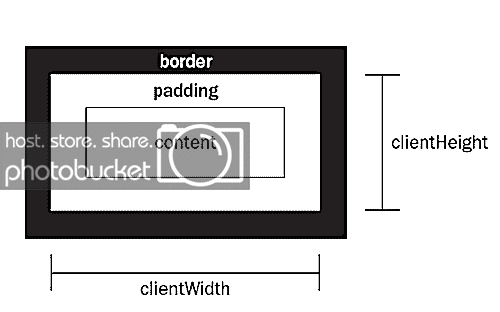
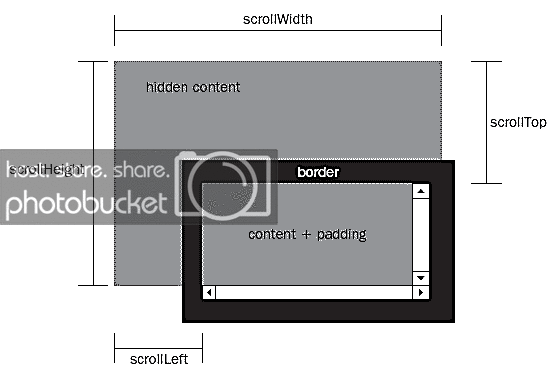
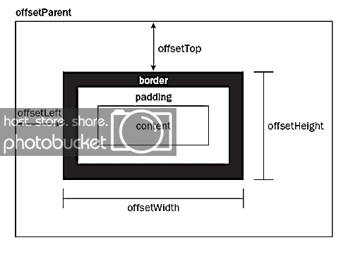
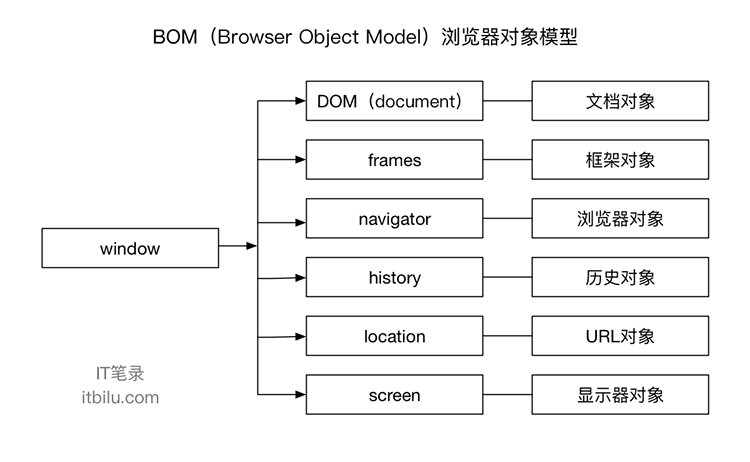

<br>

## 前言

本人平时学习及收集内容，欢迎参入一起讨论。

## 关于作者

一个工作八年的草根程序员。

## 内容

- [DOM](#一DOM)
- [BOM](#二BOM)
- [思维导图](#三思维导图)

### 一、DOM

`DOM`（文档对象模型）是`HTML`和`XML`的应用程序接口（`API`）。

`DOM`树由节点构成，节点有以下种类：元素节点、文本节点和属性节点。

- 获取 DOM 节点
- 层次节点指针
- 节点操作
- 属性操作
- 文本操作
- 获取元素大小

### 1.1 获取 DOM 节点

| 方法                   | 说明                        | 备注                 |
| ---------------------- | --------------------------- | -------------------- |
| getElementById         | 获取特定 ID 元素的节点      | 获取单个节点对象     |
| getElementsByClassName | 获取指定 class 类的节点列表 | 返回值为节点数组     |
| getElementsByTagName   | 获取相同元素的节点列表      | 返回值为节点数组     |
| getElementsByName      | 获取相同名称的节点列表      | 返回值为节点数组     |
| querySelector          | 获取 class 第一或 id 的节点 | 返回值为一个节点对象 |
| querySelectorAll       | row 2 col 2                 | 返回值为节点数组     |

### 1.2 层次节点指针

| 方法            | 说明                                    |
| --------------- | --------------------------------------- |
| childNodes      | 获取当前元素节点的所有节点              |
| firstChild      | 获取当前元素节点的第一个子节点          |
| lastChild       | 获取当前元素节点的最后一个子节点        |
| ownerDocument   | 获取该节点的文档根节点，相当与 document |
| parentNode      | 获取当前节点的父节点                    |
| previousSibling | 获取当前节点的前一个同级节点            |
| nextSibling     | 获取当前节点的后一个同级节点            |
| attributes      | 获取当前元素节点的所有属性节点集合      |

### 1.3 节点操作

| 方法            | 说明                                                                                                        |
| --------------- | ----------------------------------------------------------------------------------------------------------- |
| createElement   | 创建一个元素节点                                                                                            |
| createAttribute | 创建一个属性节点                                                                                            |
| createTextNode  | 创建一个文本节点                                                                                            |
| appendChild     | 向节点的子节点列表的末尾添加新的子节点                                                                      |
| insertBefore    | 在已知的子节点前插入一个新的子节点                                                                          |
| replaceChild    | 将某个子节点替换为另一个                                                                                    |
| cloneNode       | 创建指定节点的副本，有一个参数，其值为 true 或 false，true 复制当前节点及其所有子节点，false 仅复制当前节点 |
| removeChild     | 删除指定的节点                                                                                              |

### 1.4 属性操作

| 方法            | 说明                     |
| --------------- | ------------------------ |
| id              | 元素节点的 id 名称       |
| title           | 元素节点的 title 属性值  |
| style           | css 内联样式属性值       |
| className       | CSS 元素的类             |
| getAttribute    | 获取特定元素节点属性的值 |
| setAttribute    | 设置特定元素节点属性的值 |
| removeAttribute | 移除特定元素节点属性     |

### 1.5 文本操作

| 方法                          | 说明                                 |
| ----------------------------- | ------------------------------------ |
| insertData(offset,String)     | 从 offset 指定的位置插入 string      |
| appendData(string)            | 将 string 插入到文本节点的末尾处     |
| deleteDate(offset,count)      | 从 offset 起删除 count 个字符        |
| replaceData(off,count,string) | 从 off 将 count 个字符用 string 替代 |
| splitData(offset)             | 从 offset 起将文本节点分成两个节点   |
| substring(offset,count)       | 返回由 offset 起的 count 个节点      |

### 1.6 获取元素大小

#### 1.6.1 clientWidth 和 clientHeight

这组属性可以获取元素可视区的大小，可以得到元素内容及内边距所占据的空间大小。

```
dom.clientWidth; //400
dom.clientHeight //400

```

返回了元素大小，但没有单位，默认单位是px

1. 增加边框，无变化
2. 增加外边距，无变化
3. 增加滚动条，最张值等于原本大小减去滚动条的大小
4. 增加内边距，最终值等于原本大小加上内边距的大小



#### 1.6.2 scrollWidth 和 scrollHeight

这组属性可以获取滚动内容的元素大小

```
dom.scrollWidth
dom.scrollHeight

```

1. 增加内边距，最终值会等于原本大小加上内边距大小
2. 增加滚动条，最张值会等于原本大小送去滚动条大小


#### 1.6.3 scrollTop 和 scrollLeft

这组属性可以获取滚动条被隐藏的区域大小，也可设置定位到该区域。

```
dom.scrollTop;  //获取滚动内容上方的位置
dom.scrollLeft; //获取滚动内容左方的位置

```



#### 1.6.4 offsetWidth 和 offsetHeight

```
dom.offsetWidth;  //400
dom.offsetHeight; //400

```

返回了元素大小，默认单位是px。如果没有设置任何CSS的宽度和高度，他会得到计算后的宽度和高度。

1. offsetHeight元素在垂直方向上占用的空间大小，以像素计。包括元素的高度、（可见的）水平滚动条的高度、上边框高度和下边框高度。
2. offsetWidth元素在水平方向上占用的空间大小，以像素计。包括元素的宽度、（可见的）垂直滚动笨拙宽度、左边框宽度和右边框宽度。

#### 1.6.5 offsetLeft 和 offsetTop

这组属性可以获取当前元素相对于父元素的位置。

```
dom.offsetLeft; //20
dom.offsetTop;  //20

```



#### 1.6.6 获取元素位置的快速方法

除了上面的函数以外，还有一种快速方法，可以立刻获得网页元素的位置。

那就是使用getBoundingClientRect()方法。它返回一个对象，其中包含了left、right、top、bottom四个属性，分别对应了该元素的左上角和右下角相对于浏览器窗口（viewport）左上角的距离。

所以，网页元素的相对位置就是

```
　　var X= this.getBoundingClientRect().left;

　　var Y =this.getBoundingClientRect().top;
```

### 二、BOM

`BOM`浏览器对象模型（Browser Object Model）`BOM`对象是在Web中使用JavaScript的核心，该对象提供了与浏览器交互相关对象结构。`BOM`由多个子对象组成，其核心为window对象，它是`BOM`的顶层对象，表示在浏览器环境中的一个全局的顶级对象，所有在浏览器环境中使用的对象都是window对象的子对象。

`BOM`中的对象主要包括：DOM相关对象、frames对象、navigator对象、history对象、location对象、screen对象



### 三、思维导图


### 参考资料

- 《高程第三版》
- 《权威第 6 版》
- [温故js系列（6）-DOM](https://segmentfault.com/a/1190000006623511)

## 联系作者

<div align="center">
    <p>
        在颠覆世界的同时，也要好好关照自己。
    </p>
    
</div>
