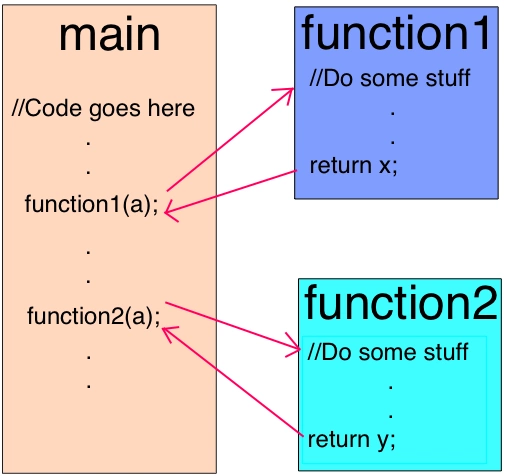
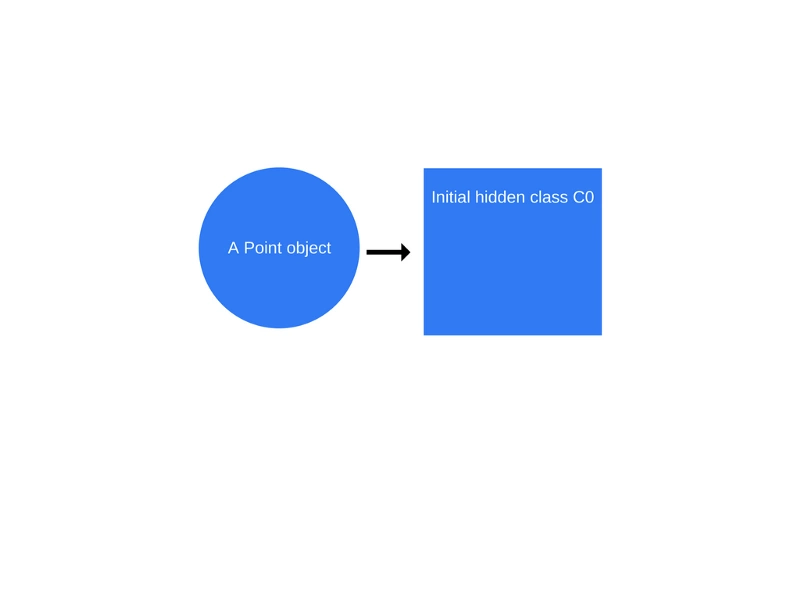
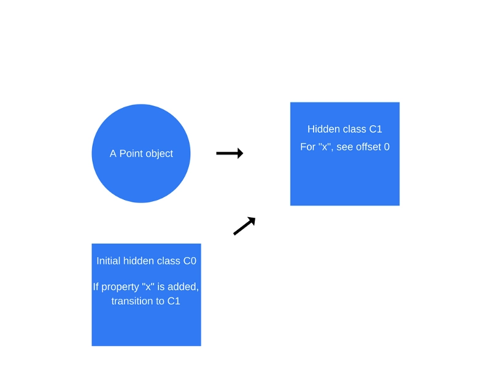
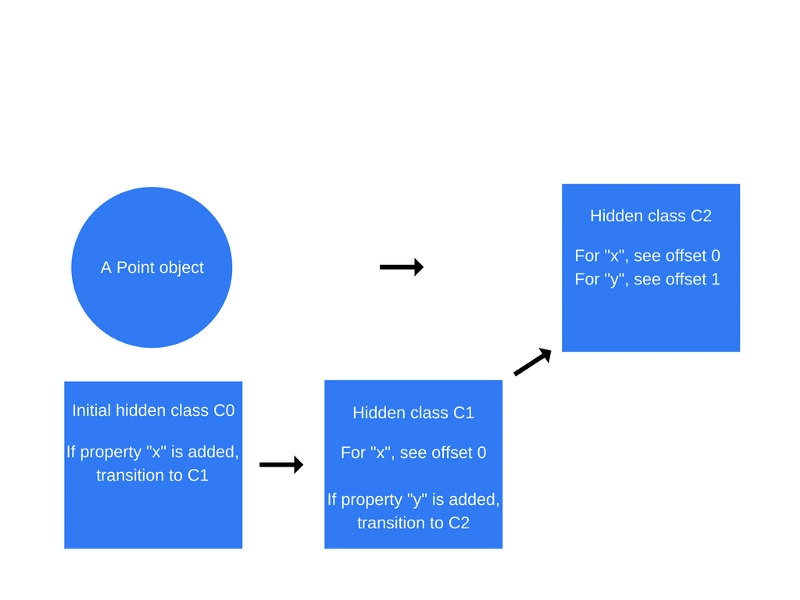
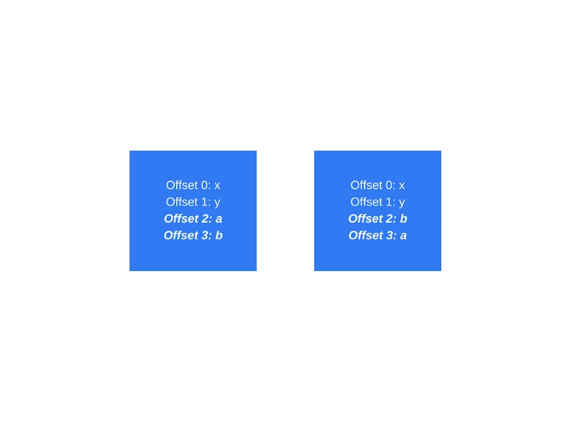
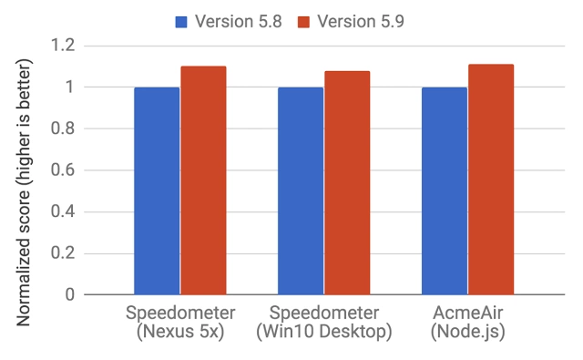

<br>

## 前言

本人平时学习及收集内容，欢迎参入一起讨论。

## 关于作者

一个工作八年的草根程序员。

## 内容

- 概述
- 为什么要创建V8引擎?
- V8 曾有两个编译器
- 内联代码
- 隐藏类
- 内联缓存
- 编译成机器码
- 垃圾收集
- 如何编写优化的JavaScript
- Ignition and TurboFan

### 一、概述

JavaScript引擎是执行JavaScript代码的程序或解释器。JavaScript引擎可以实现为标准解释器，或者以某种形式将JavaScript编译为字节码的即时编译器。

以为实现JavaScript引擎的流行项目的列表：

- [V8](https://en.wikipedia.org/wiki/V8_%28JavaScript_engine%29)——开源，由Google开发，用C++编写
- [Rhino](https://en.wikipedia.org/wiki/Rhino_%28JavaScript_engine%29)——由Mozilla基金会管理，开源，完全用Java开发
- [SpiderMonkey](https://en.wikipedia.org/wiki/SpiderMonkey)——是第一个支持 Netscape Navigator 的 JavaScript引擎，目前正供Firefor使用
- [JavaScriptCore](https://en.wikipedia.org/wiki/WebKit#JavaScriptCore)——开源，以Nitro形式销售，由苹果为Safari开发
- [KJS](https://en.wikipedia.org/wiki/KJS_%28software%29)——KDE的引擎，最初由 Harri Porten 为 KDE 项目中的 Konqueror 网页浏览器开发
- [Chakra](https://en.wikipedia.org/wiki/Chakra_%28JScript_engine%29)(JScript9)—— Internet Explorer
- [Chakra](https://en.wikipedia.org/wiki/Chakra_%28JavaScript_engine%29)——Microsoft Edge
- [Nashorn](https://en.wikipedia.org/wiki/Nashorn_%28JavaScript_engine%29)——作为 OpenJDK 的一部分，由 Oracle Java 语言和工具组编写
- [JerryScript](https://en.wikipedia.org/wiki/JerryScript)——物联网的轻量级引擎

### 二、为什么要创建V8引擎?

由谷歌构建的V8引擎是开源的，使用c++编写。这个引擎是在谷歌Chrome中使用的，但是，与其他引擎不同的是V8也用于流行的node.js。


V8最初被设计用来提高web浏览器中JavaScript执行的性能。为了获得速度，V8将JavaScript代码转换成更高效的机器码，而不是使用解释器。它通过实现JIT(Just-In-Time)编译器将JavaScript代码编译为执行时的机器码，就像许多现代JavaScript引擎（如SpiderMonkey或Rhino (Mozilla)）所做的那样。这里的主要区别是V8不生成字节码或任何中间代码。

### 三、V8 曾有两个编译器

在V8的5.9版本出来之前，V8引擎使用了两个编译器：

- full-codegen——一个简单和非常快的编译器，产生简单和相对较慢的机器码。
- Crankshaft——一种更复杂(Just-In-Time)的优化编译器，生成高度优化的代码。

V8引擎也在内部使用多个线程：

- 主纯种执行你所期望的操作：获取代码、编译代码并执行它
- 还有一个单独的线程用于编译，因此主线程可以在前者代码代码的同时继续执行
- 一个Profiler线程，它会告诉运行时我们花了很多时间，让Crankshaft可以优化它们
- 一些线程处理垃圾收集器

当第一次执行JavaScript代码时，V8利用full-codegen编译器，直接将解析的JavaScript翻译成机器代码而不进行任何转换。这使得它可以非常快速地开始执行机器代码。请注意，V8不使用中间字节码，从而不需要解释器。

当代码已经运行一段时间后，分析线程已经收集了足够的数据来判断应该优化哪个方法。

### 四、内联代码

第一个优化是提前内联尽可能多的代码。内联是用被调用函数的主体替换调用点（调用函数的代码行）的过程。这个简单的步骤允许下面的代码更有意义。



### 五、隐藏类

JavaScript是一种基于原型的语言：没有使用克隆过程创建类和对象。JavaScript也是一种动态编程语言，这意味着可以在实例化后轻松地在对象中添加或删除属性。

大多数JavaScript解释器使用类似字典的结构（基于哈希函数）来存储对象属性值在内在中的位置，这种结构使得在JavaScript中检索属性的值比在Java或C#等非动态编程语言中的计算成本更高。

在Java中，所有对象属性都是在编译之前由固定对象布局确定的，并且无法在运行时动态添加或删除（当然，C#具有动态类型，这是另一个主题）。

因此，属性值（或指向这些属性的指针）可以作为连续缓冲区存储在存储器中，每个缓冲区之间具有固定偏移量，可以根据属性类型轻松确定偏移的长度，而在运行时可以更改属性类型的JavaScript中这是不可能的

由于使用字典查找内在中对象属性的位置效率非常低，因此使用了不同的方法：隐藏类。隐藏类与Java等语言中使用的固定对象（类）的工作方式类似，只是它们是在运行时创建的。现在让我们看看他们实际的例子：

```
function Point(x,y){
    this.x = x;
    this.y = y;
}
var p1 = new Point(1,2);

```

一旦“new Point(1,2)”调用发生，V8将创建一个名为“C0”的隐藏类。



尚未为Point定义属性，因此“C0”为空。

一旦第一个语句“this.x=x”被执行（在“Point”函数内），V8将创建一个名为“C1”的第二个隐藏类，它基于“C0”。“C1”描述了可以找到属性x的存储存储器中的位置（相对于对象指针）。

在这种情况下，“x”存储在偏移0处，这意味着当将存储器中的point对象视为连续缓冲区时，第一偏移将对应于属性“x”。V8还将使用“类转换”更新“C0”，该类转换指出如果将属性“x”添加到point对象，则隐藏类应从“C0”切换到“C1”。下面的point对象的隐藏类现在是“C1”。



> 每次将新属性添加到对象时，旧的隐藏类都会更新为指向新隐藏类的转换路径。隐藏类转换非常重要，因为它们允许在以相同方式创建的对象之间共享隐藏类。如果两个对象共享一个隐藏类并且同一属性被添加到它们中，则转换将确保两个对象都接收相同的新隐藏类以及随其附带的所有优化代码。

当语句“this.y=y”被执行时，会重复同样的过程（在“Point”函数内部，“this.x=x”语句之后）。

一个名为“C2”的新隐藏类会被创建，如果将一个属性“y”添加到一个Point对象（已经包含属性“x”），一个类转换会添加到“C1”，
则隐藏类应该更改为“C2”，point对象的隐藏类更新为“C2”。



隐藏类转换取决于将属性添加到对象的顺序到对象的顺序。看看下面的代码片段：

```
function Point(x,y){
    this.x = x;
    this.y = y;
}
var p1 = new Point(1,2);
p1.a = 5;
p1.b = 6;
var p2 = new Point(3,4);
p2.b = 7;
p2.a = 8;

```

现在，假设对于p1和p2，将使用相同的隐藏类和转换。那么，对于“p1”，首先添加属性“a”，然后添加属性“b”。然而，“p2”首先分配“b”，然后是“a”。因此，由于不同的转换路径，“p1”和“p2”以不同的隐藏类别结束。在这种情况下，以相同的顺序初始化动态属性好得多，以便隐藏的类可以被征用。

### 六、内联缓存

V8利用了另一种优化动态类型语言技术，称为内联缓存。内联缓存依赖于这样一种观察，即对同一方法的得利调用往往发生在同一类型的对象上。[这里](https://github.com/sq/JSIL/wiki/Optimizing-dynamic-JavaScript-with-inline-caches)可以找到对内联缓存的深入解释。

接下来将讨论内联缓存的一般概念（如果您没有时间通过上面的深入了解）。

那么它是如何工作的呢？V8维护了在最近的方法调用中作为参数传递的对象类型的缓存，并使用这些信息预测将来作为参数传递的对象类型。如果V8能够很好地预测传递给方法的对象的类型，它就可以绕过如何访问对象属性的过程，而是使用从以前的查找到对象的隐藏类的存储信息。

那么隐藏类和内联缓存的概念如何相关呢？无论何时在特定对象上调用方法时，V8引擎都必须执行对该对象的隐藏类的查找，以确定访问特定属性的偏移量。在同一个隐藏类的两次成功的调用之后，V8省略了隐藏类的查找，并简单地将属性的偏移量添加到对象指针本身。对于该方法的所有下一次调用，V8引擎都假定隐藏的类没有更改，并使用从以前的查找存储的领衔量直接跳转到特定属性的内存地址。这大大提高了执行速度。

内联缓存也是为什么相同类型的对象共享隐藏类非常重要的原因。如果你创建两个相同类型和不同隐藏类的对象（正如我们之前的例子中所做的那样），V8将无法使用内联缓存，因为即使这两个对象属于同一类型，它们对应的隐藏类为其属性分配不同的偏移量。



> 这两个对象基本相同，但是“a”和“b”属性的创建顺序不同。

### 七、编译成机器码

一旦Hydrogen图被优化，Crankshaft将其降低到称为Lithium的较低级表示。大部分的Lithium实现都是特定于架构的。寄存器分配往往发生在这个级别。

最后，Lithium被编译成机器码。然后就是OSR：on-stack replacement(堆栈替换)。在我们开始编译和优化一个明确的长期运行的方法之前，我们可能会运行堆栈替换。V8不只是缓慢执行堆栈替换，并再次开始优化。相反，它会转换我们拥有的所有上下文（堆栈，寄存器），以便在执行过程中切换到优化版本上。这是一个非常复杂的任务，考虑到除了其他优化之外，V8最初还将代码内联。V8不是唯一能够做到的引擎。

有一种叫去优化的安全措施来进行相反的转换，并在假设引擎无效的情况下返回未优化的代码。

### 八、垃圾收集

对于垃圾收集，V8采用的mark-and-sweep算法来清理旧一代。标记阶段应该停止JavaScript执行。为了控制GC成本并使执行更稳定，V8使用增量标记：不是遍历整个堆，尝试标记每个可能的对象，它只是遍历堆的一部分，然后懒得正常执行。下一个GC停止将停止的位置继续，这允许在正常执行期间非常短暂的暂停，如前所述，扫描阶段由单独的线程处理。

### 九、如何编写优化的JavaScript

1. **对象属性的顺序**：始终以相同的顺序实例化对象属性，以便可以共享隐藏的类和随后优化的代码。
2. **动态属性**：因为在实例化之后向对象添加属性将强制执行隐藏的类型更改，并降低之前隐藏类所优化的所有方法的执行速度，所以在其构造函数中分配所有对象的属性。
3. **方法**：重复执行相同方法的代码将比仅执行一次的多个不同方法（由于内联缓存）的代码运行得更快。
4. **标记值**：V8使用32位表示对象和数值。由于数值是31位的，它使用了一位来区分它是一个对象（flag=1）还是一个称为SMI（SMall Integer）整数(flag=0)。那么，如果一个数值大于31位，V8会将该数字装箱，把它变成一个双精度数，并创建一个新的对象来存放该数字。尽可能使用31位有符号数字，以避免对JS对象的高开销的装箱操作。

### 十、Ignition and TurboFan

随着2017年早些时候发布V8 5.9，引入了新的执行管道。 这个新的管道在实际的JavaScript应用程序中实现了更大的性能提升和显着节省内存。

新的执行流程是建立在 Ignition（ V8 的解释器）和 TurboFan（ V8 的最新优化编译器）之上的。

自从 V8 5.9 版本问世以来，由于 V8 团队一直努力跟上新的 JavaScript 语言特性以及这些特性所需要的优化，V8 团队已经不再使用 full-codegen 和 Crankshaft（自 2010 年以来为 V8 技术所服务）。

这意味着 V8 整体上将有更简单和更易维护的架构。



这些改进只是一个开始。 新的Ignition和TurboFan管道为进一步优化铺平了道路，这些优化将在未来几年内提升JavaScript性能并缩小V8在Chrome和Node.js中的占用空间。

### 参考资料

- [JavaScript是如何工作的：深入V8引擎&编写优化代码的5个技巧](https://github.com/qq449245884/xiaozhi/issues/2)
- [JavaScript深入浅出第4课：V8引擎是如何工作的？](https://blog.fundebug.com/2019/07/16/how-does-v8-work/)
- [认识 V8 引擎](https://zhuanlan.zhihu.com/p/27628685)

## 联系作者

<div align="center">
    <p>
        平凡世界，贵在坚持。
    </p>
    
</div>