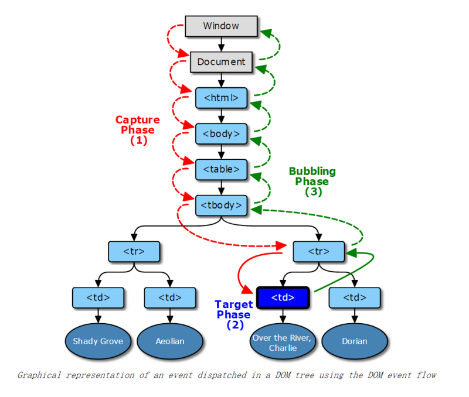

<br>

## 前言

本人平时学习及收集内容，欢迎参入一起讨论。

## 关于作者

一个工作八年的草根程序员。

## 内容

- [事件流](#一事件流)
- [事件处理](#二事件处理)
- [事件对象](#三事件对象)
- [事件类型](#四事件类型)
- [事件委托](#五事件委托)
- [模拟事件](#六模拟事件)

### 一、事件流

"DOM2级事件"规定的事件流包括三个阶段：事件捕获阶段、处于目标阶段、事件冒泡阶段。



**捕获阶段：**事件从Document节点自上而下向目标节点传播的阶段；
**目标阶段：**真正的目标节点正在处理事件的阶段；
**冒泡阶段：**事件从目标节点自上而下向Document节点传播的阶段;

### 二、事件处理

- [HTML事件处理程序](#21-html事件处理程序)
- [DOM0级事件处理程序](#22-DOM0级事件处理程序)
- [DOM2级事件处理程序（不支持IE）](#23-dom2级事件处理程序不支持ie)
- [IE事件处理程序](#24-IE事件处理程序)
- [跨浏览器的事件处理程序](#25-跨浏览器的事件处理程序)

#### 2.1 HTML事件处理程序

它是写在html里面的，是全局作用域。

```
例子代码--点击事件触发alert函数
<button onclick="alert('hello')"></button>

```

#### 2.2 DOM0级事件处理程序

```
<button id="btn">点击</button>
 
<script>
  var btn=document.getElementById("btn");
  btn.onclick=function(){
    alert("hello");
  }
</script>

```

#### 2.3 DOM2级事件处理程序（不支持IE）

有了DOM2级事件处理程序，其中定义了两个方法：

- addEventListener() ---添加事件侦听器
- removeEventListener() ---删除事件侦听器

函数均有3个参数:

- 第一个参数是要处理的事件名(不带on前缀的才是事件名)
- 第二个参数是作为事件处理程序的函数
- 第三个参数是一个boolean值，默认false表示使用冒泡机制，true表示捕获机制。

```
<button id="btn">点击</button>
 
<script>
  var btn=document.getElementById("btn");
  btn.addEventListener('click',hello，false);
  btn.addEventListener('click',hello，false);
  function hello(){
    alert("hello");
  }
</script>

```

#### 2.4 IE事件处理程序

IE事件处理程序中有类似与DOM2级事件处理程序的两个方法：

1. attachEvent()
2. detachEvent()

它们都接收两个参数：

1. 事件处理程序名称。如onclick、onmouseover，注意：这里不是事件，而是事件处理程序的名称，所以有on。
2. 事件处理程序函数。

```
<button id="btn">点击</button>
 
<script>
  var btn=document.getElementById("btn");
  btn.attachEvent('onclick',hello);
  btn.detachEvent('onclick',hello);
  function hello(){
    alert("hello");
  }
</script>
```

#### 2.5 跨浏览器的事件处理程序

```

var EventUtil={
    addHandler:function(element,type,handler){
        if(element.addEventListener){
            element.addEventListener(type,handler,false);
        }else if(element.attachEvent){
            element.attachEvent('on'+type,handler);
        }else{
            element['on'+type]=handler;
        }
    },
    removeHandler:function(element,type,handler){
        if(element.removeEventListener){
            element.removeEventListener(type,handler,false);
        }else if(element.detachEvent){
            element.detachEvent('on'+type,handler);
        }else{
            element['on'+type]=null;
        }
    }
}

```

这两个方法接收相同的三个参数：

1. 要操作的元素--通过dom方法获取
2. 事件名称--注意：没有on，如"click"、"mouseover"
3. 事件处理程序函数--对应的函数

### 三、事件对象

- [DOM中的事件对象](#31-dom中的事件对象)
- [ie中的事件对象](#32-ie中的事件对象)
- [跨浏览器的事件对象](#33-跨浏览器的事件对象)

#### 3.1 DOM中的事件对象

| 属性/方法                  | 类型         | 读/写 | 说明                                                                                        |
| -------------------------- | ------------ | ----- | ------------------------------------------------------------------------------------------- |
| bubbles                    | Boolean      | 只读  | 表明事件是否冒泡                                                                            |
| cancelable                 | Boolean      | 只读  | 表明是否可以取消事件的默认行为                                                              |
| currentTarget              | Element      | 只读  | 其事件处理程序当前正在处理事件的那个元素                                                    |
| defaultPrevent             | Boolean      | 只读  | 为true表示已经调用              了preventDefault()                                          |
| detail                     | Integer      | 只读  | 与事件相关的细节信息                                                                        |
| eventPhase                 | Integer      | 只读  | 调用事件处理程序的阶段：1表示捕获阶段，2表示“处于目标”，3表示冒泡阶段                       |
| preventDefault()           | Function     | 只读  | 取消事件的默认行为。如果cancelable是true，则可以使用这个方法                                |
| stopImmediatePropagation() | Function     | 只读  | 取消事件的进一步捕获或冒泡，同时阻止任何事件处理程序被调用（DOM3级事件中新增）              |
| stopPropagation()          | Function     | 只读  | 取消事件的进一步捕获或冒泡。如果bubbles为true，则可以使用这个方法                           |
| target                     | Element      | 只读  | 事件的目标                                                                                  |
| trusted                    | Boolean      | 只读  | 为true表示事件是浏览器生成的。                      为false表示事件是由开发人员通过js创建的 |
| type                       | String       | 只读  | 被触发的事件类型                                                                            |
| view                       | AbstractView | 只读  | 与事件关联的抽象视图。                                                                      |

#### 3.2 IE中的事件对象

| 属性/方法    | 类型    | 读/写 | 说明                                                                                               |
| ------------ | ------- | ----- | -------------------------------------------------------------------------------------------------- |
| cancelBubble | Boolean | 读/写 | 默认值为false，但将其设置为true就可以取消事件冒泡（与DOM中的stopPropagation()方法的作用相同）      |
| returnValue  | Boolean | 读/写 | 默认值为true，但将其设置为false就可以取消事件的默认行为（与DOM中的preventDefault()方法的作用相同） |
| srcElement   | Element | 只读  | 事件的目标（与DOM中的targe属性相同）                                                               |
| type         | String  | 只读  | 被触发的事件的类型                                                                                 |

#### 3.3 跨浏览器的事件对象

```
var EventUtil={
    addHandler:function(element,type,handler){
        if(element.addEventListener){
            element.addEventListener(type,handler,false);
        }else if(element.attachEvent){
            element.attachEvent('on'+type,handler);
        }else{
            element['on'+type]=handler;
        }
    },
    removeHandler:function(element,type,handler){
        if(element.removeEventListener){
            element.removeEventListener(type,handler,false);
        }else if(element.detachEvent){
            element.detachEvent('on'+type,handler);
        }else{
            element['on'+type]=null;
        }
    },
    getEvent:function(event){
        return event?event:window.event;
    },
    getTarget:function(event){
        return event.target || event.srcElement;
    },
    preventDefault:function(event){
        if(event.preventDefault){
            event.preventDefault();
        }else{
            event.returnValue=false;
        }
    },
    stopPropagetion:function(event){
        if(event.stopPropegation){
            event.stopPropagation();
        }else{
            event.cancelBubble=true;
        }
    }
}

```

### 四、事件类型

- [UI事件](#41-ui事件)
- [焦点事件](#42-焦点事件)
- [鼠标与滚轮事件](#43-鼠标与滚轮事件)
- [键盘与文本事件](#44-键盘与文本事件)
- [复合事件](#45-复合事件)
- [变动事件](#46-变动事件)
- [HTML5事件](#47-html5事件)
- [设备事件](#48-设备事件)
- [触摸与手势事件](#49-触摸与手势事件)

#### 4.1 UI事件

- load
- unload
- abort
- error
- select
- resize
- scroll

#### 4.2 焦点事件

- blur 失去焦点(不冒泡)
- focusin(冒泡)
- focusout(冒泡)
- focus(不冒泡)

#### 4.3 鼠标与滚轮事件

- click
- dbclick
- mousedown
- mouseenter
- mouseleave
- mousemove
- mouseup
- mouseout 鼠标位于一个元素外部，然后将其首次移动到另一个元素边界之内时触发。
- mouseover 鼠标位于一个元素上，然后将鼠标移入另一个元素时触发。
- meousewheel 鼠标滚轮事件

#### 4.4 键盘与文本事件

- keydown 按下键盘上的`任意键`时触发，按住不放会重复触发。
- keyup 当用户释放键盘上的键时触发。
- keypress 当用户按下键盘上的字符键时触发，而且如果按住不放的话，会重复触发此事件。
- textInput 当用户在可编辑区域中输入字符时触发按下`实际字符键`才触发。

#### 4.5 复合事件

复合事件是 DOM3 级事件中心添加的一类事件，用于处理 IME 的输入序列（输入法输入时的事件）。

复合事件有以下三中：

- compositionstart：要开始输入。
- compositionupdate：插入新字符。
- compositionend：复合系统关闭，返回正常键盘输入状态。

#### 4.6 变动事件

- DOMSubtreeModified 在DOM结构中发生任何变化时触发。这个事件在其他任何事件触发后都会触发。
- DOMNodeInserted在一个节点作为子节点被插入到另一个节点中时触发。
- DOMNodeRemoved在节点从其父节点被插入到另一个节点中时触发。
- DOMNodeInsertedIntoDocument在一个节点被直接插入文档或通过子树间接插入文档之后触发（在DOMNodeInserted之后）。
- DOMAttrModified在属性被修改之后触发。
- DOMCharacterDataModified在文本节点的值发生改变时触发。

#### 4.7 HTML5事件

- contextmenu 右键打开菜单栏
- beforeunload页面卸载前
- DOMContentLoaded形成完整DOM树时触发
- readystatechange页面加载相关
- pageshow pagehide前后退事件
- hashchage事件

#### 4.8 设备事件

- orientationchange 切换横竖屏
- deviceorientation 设备在空间中朝向哪里
- devicemotion 检测每个方向的加速度

#### 4.9 触摸与手势事件

- touchstart
- touchmove
- touchend
- touchcancel

手势

- gesturestart 当一个手指已经在屏幕上而另一个手指又触摸屏幕时触发
- gesturechange 当触摸屏幕的任何一个手指的位置发生变化时触发
- gestureend 任何一个手指从屏幕上移开时触发

当触摸屏幕上的元素时，会依次执行如下事件：

- touchstart
- mouseover
- mousemove
- mousedown
- mouseup
- click
- touchend

### 事件委托

```
    <button id="btnAdd">添加</button>
    <ul id="ulList">
        <li>1</li>
        <li>2</li>
        <li>3</li>
    </ul>
    <script>
        var btnAdd = document.getElementById('btnAdd');
        var ulList = document.getElementById('ulList');
        var num = 3;

        ulList.onclick = function(event){
            var event = event || window.event;
            var target = event.target || event.srcElement;
            if(target.nodeName.toLowerCase() == 'li'){
                alert(target.innerHTML);
            }
        }

        btnAdd.onclick = function () {
            num++;
            var li = document.createElement('li');
            li.innerHTML = num;
            ulList.appendChild(li);
            doclick();
        }
    </script>

```

### 六、模拟事件

```
var event = document.createEvent(type);

```

- event 就是被创建的 Event 对象.
- type 是一个字符串，表示要创建的事件类型。事件类型可能包括`UIEvents`, `MouseEvents`, `MutationEvents`, 或者 HTMLEvents(一般为 DOM 变动事件)。
- dom.dispatchEvent() 触发事件。

### 参考资料

- 《高程第3版》
- 《权威第6版》

## 联系作者

<div align="center">
    <p>
        平凡世界，贵在坚持。
    </p>
    
</div>
