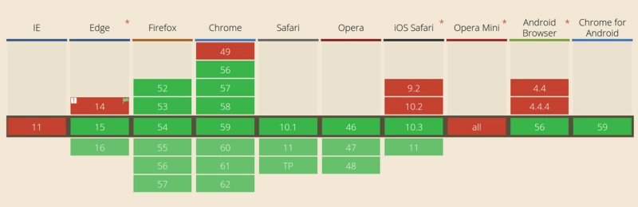

<br>

## 前言

在单线程环境中编程的缺陷以及如何解决这些缺陷来构建健壮的 JavaScript UI。按照惯例，在本文的最后，分享 5 个如何使用 async/ wait 编写更简洁代码的技巧。

## 关于作者

一个工作八年的草根程序员。

## 内容

- [为什么单线程是一个限制？](#一为什么单线程是一个限制)
- [JavaScript 程序的构建块](#二javascript-程序的构建块)
- [解析事件循环](#三解析事件循环)
- [setTimeout(…) 是怎么工作的](#四settimeout-是怎么工作的)
- [ES6 的任务队列是什么?](#五es6-的任务队列是什么)
- [回调](#六回调)
- [嵌套回调](#七嵌套回调)
- [Promise](#八promise)
- [Promise Value](#九promise-value)
- [使用 Promise 还是不用？](#十使用-promise-还是不用)
- [吞掉错误或异常](#十一吞掉错误或异常)
- [处理未捕获异常](#十二es8-中改进了什么-asyncawait-异步等待)
- [ES8 中改进了什么 ?Async/await （异步/等待）](#十三es8-中改进了什么-asyncawait-异步等待)
- [编写高度可维护性、非易碎异步代码的 5 个技巧]((#十四编写高度可维护性非易碎异步代码的-5-个技巧))

### 一、为什么单线程是一个限制？

当调用堆栈中有函数调用需要花费大量时间来处理时会发生什么？

例如，假设在浏览器中运行一个复杂的图像转换算法。

当调用堆栈有函数要执行时，浏览器不能做任何其他事情——它被阻塞了。这意味着浏览器不能渲染，不能运行任何其他代码，只是卡住了。那么你的应用 UI 界面就卡住了，用户体验就不那么好了。

在某些情况下，这可能不是主要的问题。还有一个更大的问题是一旦你的浏览器开始处理调用堆栈中的太多任务，它可能会在很长一段时间内停止响应。这时，很多浏览器会抛出一个错误，提示是否终止页面：


### 二、JavaScript 程序的构建块

你可能在单个.js 文件中编写 Javascript 应用程序，但可以肯定的是，你的程序由几个块组成，其中只有一个正在执行，其余的将在稍后执行。最常见的单元是函数。

大多数刚接触 JavaScript 的开发人员似乎都有这样的问题，就是认为所有函数都是同步完成，没有考虑异步的情况。如下例子：

```
// ajax 由某个库提供
var response = ajax('https://example.com/api');
console.log(response);

```

你可能知道标准 Ajax 请求不是同步的，这说明在代码执行时`Ajax(...)`函数还没有返回任何值来分配给变量`response`。

一种等待异步函数返回的结果简单的方式就是**回调函数**：

```
ajax('https://expamle.com/api',function(response){
    console.log(response);  // 'response' 现在可用
})

```

注意实际上可以设置同步 Ajax 请求，但记录不要那样做。如果设置同步 Ajax 请求，应用程序的界面将被阻塞——用户将无法单击、输入数据、导航或滚动。这将阻止任何用户交互，这是一种可怕的做法。

以下是同步 Ajax 地，但请千万不要这样做：

```
jQuery.ajax({
    url:'https://api.example.com/endpoint',
    success:function(response){
        //  处理一些事情
    },
    async:false // 这是一个可怕的想法
});

```

这里使用 Ajax 请求作为示例，你可以让任何代码块异步执行。

这可以通过 setTimerout(callback,milliseconds)函数来完成。setTimeout 函数的作用是设置一个架设函数 milliseconds 后执行，如下：

```
function first(){

}
```

输出：

```
first
third
second

```

### 三、解析事件循环

这里从一个有点奇怪的声明开始——尽管允许异步 Javascript 代码（就像上例讨论的 setTimeout）,但在 ES6 之前，JavaScript 本身实际上从来没有任何内置异步的概念，JavaScript 引擎在任何给定时刻只执行一个块。

那么，是谁告诉 JS 引擎执行程序的代码块呢？实际上，JS 引擎并不是单独运行的——它是在一个宿主环境中运行的，对于大多数开发人员来说，宿主环境就是典型的 web 浏览器或 Node.js。实际上，现在 JavaScript 被嵌入到各种各样的设备中，从机器人到灯泡，每个设备代表 JS 引擎的不同类型的托管环境。

所有环境中的共同点是一个称为**事件循环**的内置机制，它处理程序的多个块在一段时间内通过调用`JS`引擎的执行。

这意味着 JS 引擎只是任意 JS 代码的按需执行环境，是宿主环境处理事件运行及结果。

例如，当 JavaScript 程序发出 Ajax 请求从服务器获取一些数据时，在函数（“回调”）中设置“response”代码，JS 引擎告诉宿主环境：“我现在要推迟执行，但当完成那个网络请求时，会返回一些数据，请回调这个函数并给数据传给它”。

然后浏览器将侦听到的响应，当监听到网络请求返回内容时，浏览器通过将回调函数插入事件循环来调度要执行的回调函数。以下是示意图：


这些 Web api 是什么？从本质上说，它们是无法访问的线程，只能调用它们。它们是浏览器的迸发部分。如果你是一个 nodejs 开发者，这些就是 c++的 Api。

这样的迭代在事件循环中称为**(tick)标记**，每个事件只是一个函数回调。

```
console.log('Hi');

setTimeout(function cb1(){
    console.log('cb1');
},5000);

console.log('Bye');

```

让我们“执行”这段代码，看看会发生什么：

1. 初始化状态都为空，浏览器控制台是空的，调用堆栈也是空的


2. `console.log('Hi')`添加到调用堆栈中


3. 执行`console.log('Hi')`


4. `console.log('Hi')`从调用堆栈中移除


5. setTimeout(function cb1(){...}) 添加到调用堆栈


6. setTimeout(function cb1(){...})执行，浏览器创建一个计时器计时，这个作为 Web api 的一部分。


7. setTimeout(function cb1(){...})本身执行完成，并从调用堆栈中删除。


8. console.log('Bye')添加到调用堆栈


9. 执行 console.log('Bye')


10. console.log('Bye')从调用堆栈移除


11. 至少在 5 秒之后，计时器完成并将`cb1`回调堆到回调队列。


12. 事件循环从回调队列中获取 cb1 并将其推入调用堆栈。


13. 执行`cb1`并将`console.log('cb1')`添加到调用堆栈。


14. 执行`console.log('cb1')`


15. `console.log('cb1')`从调用堆栈中移除


16. `cb1`从调用堆栈中移除


**快速回顾**


值得注意的是，`ES6`指定了事件循环应该如何，这意味着在技术上它属于 JS 引擎的职责范围，不再仅仅扮演宿主环境的角色。这种变化的一个主要原因是`ES6`中引入了`Promises`，因为`ES6`需要对事件循环队列上的调度操作进行直接、细度的控制。

### 四、setTimeout(…) 是怎么工作的

需要注意的是，setTimeout(...)不会自动将架设放到事件循环队列中。它设置了一个计时器。当计时器过期时，环境将回调放到事件循环中，以便

```
setTimeout(myCallback,1000);

```

这并不意味着`myCallback`将在 1000 毫秒后就执行，而是在 1000 毫秒后，`myCallback`被添加到队列中。但是，如果队列有其他事件在前面添加回调刚必须等待前后的执行前后的执行后在执行`myCallback`。

有不少的文章和教程上开始使用异步 Javascript

```
console.log('Hi');
setTimeout(function(){
    console.log('callback');
},0);
console.log('Bye');

```

虽然等待时间被设置为 0ms，但在浏览器控制台的结果如下：

```
Hi
Bye
callback
```

### 五、ES6 的任务队列是什么?

`ES6`中引入了一个名为"任务队列"的概念。它是事件循环队列上的一个层。最为常见在`Promise`处理的异步方式。

现在只讨论这个概念，以便在讨论带有`Promises`的异步行为时，能够了解 Promises 是如何调度和处理。

想你一下：任务队列是一个附加到事件循环队列中每个标记末尾的队列。某些异步操作可能发生在事件循环的一个标记期间，不会导致一个全新的事件被添加到事件循环队列中。而是将一个项目(即任务)添加到当前标记的任务队列的末尾。

这意味着可以放心添加另一个功能以便稍后执行，它将在其他任何事情之前立即执行。

任务还可能创建更多任务添加到同一队列的末尾。理论上，任务“循环”（不断添加其他任务等等）可以无限运行，从而使程序无法获得转移到下一个事件循环票房的必要资源。从概念上讲，这类似于在代码中表示长时间运行或无限循环(如 while(true)..)。

任务有点像 setTimeout(callback,0) "hack"，但其实现方式是引入一个定义更明确、更有保证的顺序：稍后，但越快越好。

### 六、回调

正如你已经知道的，回调是到目前为止`JavaScript`程序中表达和管理异步最常见的方法。实际上，回调是`JavaScript`语言中最基本的异步模式。无数的`JS`程序，甚至是非常复杂的程序，除了一些基本都是在回调异步基础上编写的。

然而回调方式还是有一些缺点，许多开发人员都在试图找到更好的异步模式。但是，如果不了解底层的内容，就不可能有效地使用任何抽象出来的异步模式。

在下一章中，我们将深入探讨这些抽象，以说明为什么更复杂的异步模式(将在后续文章中讨论)是必要的，甚至是值得推荐的。

### 七、嵌套回调

请看以下代码：

```
listen('click',function(e){
    setTimeout(function(){
        ajax('https://api.example.com/endpoint',function(text){
            if(text == 'hello'){
                doSomething();
            }else if(text == 'world'){
                doSomethingElse();
            }
        })
    },500);
})
```

我们有一个由三个函数组成的链嵌套在一起，每个函数表示异步系列中的一个步骤。

这种代码通常被称为“回调地狱”。但是“回调地狱”实际上与嵌套/缩进几乎没有任何关系，这是一个更深层次的问题。

首先，我们等待“单击”事件，然后等待计时器触发，然后等待Ajax响应返回，此时可能会再次重复所有操作。

乍一看，这段代码似乎可以将其异步性自然地对应到以下顺序步骤：

```
listen('click',function(e){
    // ..
});

```

然后

```
setTimeout(function(){
    // ..
},500);

```

接着：

```
ajax('https://api.example.com/endpoint',function(text){
    // ..
});

```

最后：

```
if(text == 'hello'){
    doSomething();
}else if(text == 'world'){
    doSomethingElse();
}

```

因此，这种连续的方式来表示异步代码似乎更自然，不是吗？一定有这样的方法，对吧？

### 八、Promise

请看下面的代码：

```
var x = 1;
var y = 2;
console.log(x+y);

```

这非常简单它对`x`和`y`的值进行求和，并将其打印到控制台。但是，如果`x`或`y`的值丢失了，仍然需要求值，需要怎么办？

例如，需要从服务器取回`x`和`y`的值，然后才能在表达式中使用它们。假设我们有一个函数`loadX`和`loadY`，它们分别从服务器`x`和`y`的值。然后，一旦`x`和`y`都被加载，假设我们有一个函数`sum`，它对`x`和`y`的值进行求和。

**它可能看起来像这样（很丑，不是吗？）**

```
function sum(getX,getY,callback){
    var x,y;
    getX(function(result){
        x = result;
        if(y!==undefined){
            callback(x+y);
        }
    });
    getY(function(result){
        y = result;
        if(x !==undefined){
            callback(x + y);
        }
    });
}
// 获取`x`值的同步或异步函数
function fetchX(){
    // ...
}

//获取'y'值的同步或异步函数
function fetchY(){
    // ..
}
sum(fetchX,fetchY,function(result){
    console.log(result)
});

```

这里有一些非常重要的事情——在这个代码片段中，我们将x和y作为异步获取的值，并且执行了一个函数sum(...)(从外部)，它不关心x和y，也不关心它们是否立即可用。

当然，这种基于回调的粗略方法还有很多不足之处。这只是一个我们不必判断对于异步请求的值的处理方式一个小步骤而已。

### 九、Promise Value

用Promise来重写上例：

```
function sum(xPromise,yPromise){
    // "Promise.all([..])" 参数为一个Promise数组，并返回一个新的Promise.
    // 该 Promise 将等待数组中所有的Promise完成
    return Promise.all([xPromise,yPromise]).then(function(values){
        // "值"是来自先前的解析的Promise的参数数组
        return values[0] + values[1];
    })
}

// 'fetchX()'和'fetchY()'返回各自值的Promise
sum(fetchX(),fetchY())

// 我们得到两个数之和的Promise，然后等待那这个的Promise解析
.then(function(sum){
    console.log(sum);
});

```

在这个代码片段中有两层Promise。

`fetchX`和`fetchY`先直接调用，返回一个promise，传给`sum`。`sum`创建并返回一个Promise,通过调用then等待Promise，完成后，sum已经准备好了(resolve)，将会打印出来。

第二层是`sum(..)`创建的Promise(通过Promise.all([...]))然后返回Promise，通过调用then(...)来等待。当`sum(...)`操作完成时，sum传入的两个Promise都执行完后，可以打印出来了。这里隐藏了在`sum(..)`中等待`x`和`y`未来值的逻辑。

**注意：**在sum(...)内，Promise.all([...])调用创建一个promise(等待promiseX和promiseY解析)。然后链式调用.then(...)方法里再的创建了另一个Promise，然后把返回的x和y(values[0]+values[1])进行求和并返回。

因此，我们在sum(...)末尾调用then(...)方法——实际上是返回的第二个Promise上运行，而不是由Promise.all([...])创建Promise。此外，虽然没有在第二个Promise结束时再调用then方法，其实这里也创建一个Promise。

Promise.then(...)实际上可以使用两个函数，第一个函数用于执行成功的操作，第二个函数用于处理失败的操作；

如果在获取`x`或`y`时出现错误，或者在添加过程中出现某种失败，`sum(...)`返回的Promise将被拒绝，传递给then(...)的第二个回调错误处理程序将从Promise接收失败的信息。

从外部看，由于Promise封装了依赖于时间的状态（等待底层值的完成或拒绝，Promise本身是与时间无关的），它可以按照可预测的方式组成，不需要开发者关心时序或底层的结果。一旦Promise决议，此刻它就成为了外部不可变的值。

**可链接调用Promise真的很有用：**

创建一个延迟2000ms内完成的Promise，然后我们从第一个then(...)回调中返回，这会导致第二个then(..)等待2000ms

>注意：因为Promise一旦被解析，它在外部是不可变的，所以现在可以安全地将该值传递给任何一方，因为它不能被意外地或恶意地修改，这一点在多方遵守承诺的决议时尤其正确。一方不可能影响另一方遵守承诺决议的能力，不变性听起来像一个学术话题，但它实际上是承诺设计最基本和最重要的方面之一，不应该被随意忽略。

### 十、使用 Promise 还是不用？

关于Promise的一个重要细节是要确定某个值是否是一个实际的Promise。换句话说，它是否具有像Promise一样行为？：

我们知道Promise是由`new Promise(...)`语法构造的，你可能认为`p instanceof Promise`是一个足够可以判断的类型，嗯，不完全是。

这主要是因为可以从另一个浏览器窗口(例如iframe)接收Promise值，而该窗口或框架具有自己的Promise值，与当前窗口或框架中的Promise值不同，所以该检查将无法识别Promise实例。

此外，库或框架可以选择性的封装自己的Promise，而不使用原生ES6的Promise来实现。事实上，很可能在老浏览器的库中没有Promise。

### 十一、吞掉错误或异常

如果在Promise创建中，出现了一个javascript一场错误(TypeError或者ReferenceError)，这个异常会被捕捉，并且使用这个promise被拒绝。

但是，如果在调用then(...)方法中出现了JS异常错误，那么会发生什么情况呢？即使它不会丢失，你可能会发现它们的处理方式有点令人吃惊，直到你控得更深一点：

```
var p = new Promise(function(resolve,reject){
    resolve(374);
})

p.then(function fulfilled(message){
    foo.bar();  // foo没有被定义，这里抛出错误
    console.log(message);   // 不会被输出
},function rejected(){
    // 不会被执行
});

```

看起来`foo.bar()`中的异常确实被吞噬了，不过它不是。然而还有一些更深层次的问题，我们没有注意到。p.then(...)调用本身返回另一个Promise，该Promise将被TypeError异常拒绝。

### 十二、处理未捕获异常

许多人会说，还有其他更好的方法。

一个常见的建议是，Promise应该添加一个`done(...)`，这实际上是将Promise链标记为`done`。done(...)不会创建并返回Promise，因此传递给done(..)的回调显然不会将问题报告给不存在的链接Promise。

Promise对象的回调链，不管以then方法或catch方法结尾，要是最后一个方法招聘错误，都有可能无法捕捉到(因为Promise内部的错误不会冒泡到全局)。因此，我们可以提供一个done方法，总是处于回调链的尾端，保证抛出任何可能出现的错误。

```
var p = Promise.resolve(374);

p.then(function fulfilled(msg){
    console.log(msg.toLowerCase());
}).done(null,function(){
    // 如果在这里引起异常，它将被全局抛出
})
```

### 十三、ES8 中改进了什么 ?Async/await （异步/等待）

JavaScript ES8引入了`async/await`，这使得使用Promise的工作更容易。这里将简要介绍async/await提供的可能性以及如何利用它们编写异步代码。

使用async声明异步函数。这个函数返回一个`AsyncFunction`对象。AsyncFunction对象表示该函数中包含的代码异步函数。

调用使用async声明函数时，它返回一个Promise。当这个函数返回一个值时，这个值只是一个普通值而已，这个函数内部将自动创建一个承诺，并使用函数的返回的值进行解析。当这个函数招聘异常时，Promise将被抛出的值拒绝。

使用async声明函数时可以包含一个await符号，await暂停这个函数的执行并等待传递的Promise的解析完成，然后恢复这个函数的执行并返回解析后的值。

>async/await的目的是简体使用承诺的行为

让看看下面的例子：

```
function getNumber1(){
    return Promise.resolve('374');
}

// 这个函数与geNumber1相同
async function getNumber2(){
    return 374;
}
```

类似地，抛出异常的函数等价于返回被拒绝的Promise的函数：

```
function f1(){
    return Promise.reject('Some error');
}

async function f2(){
    throw 'Some error';
}
```

`await`关键字只能在异步函数中使用，并允许同步等待Promise。如果在async函数之外使用Promise，仍然需要使用then回调：

```
async function loadData(){
    // 'rp' is a request-promise function
    var promise1 = rp('https://api.example.com/endpoint1');
    var promise2 = rp('https://api.example.com/endpoint2');

    // 目前，这两个请求都是同时触发的，现在必须等待它们完成
    var response1 = await promise1;
    var response2 = await promise2;
    return reponse1 + ' ' + response2;
}
// 因为不再处于“异步函数”中，必须使用“then”
loadData().then(()=>console.log('Done'));
```

还可以使用“异步函数表达式”定义异步函数。异步函数表达式与异步函数语句非常相似，语法也几乎相同。异步函数表达式和异步函数语句之间的主要区别是函数名，可以异步函数表达式中活力函数名来创建匿名函数。异步函数表达式可以用作生命(立即调用的函数表达式)，一旦定义它就会运行。

```
var loadData = async function(){
    // 'rp' is a request-promise function.
    var promise1 = rp('https://api.examlpe.com/endpoint1');
    var promise2 = rp('https://api.examlpe.com/endpoint2);

    // Currently,both requests are fired, concurrently and now we`ll have to wait for them to finish
    var response1 = await promise1;
    var response2 = await promise2;
    return reponse1 + ' ' + response2;
}
```

更重要的是，在所有主流的浏览器都支持async/await:



最后，重要的是不盲目选择编写异步代码的“最新”方法。理解异步JavaScript的内部结构非常重要，了解为什么异步JavaScript如此关键，并深入理解所选择的方法的内部结构。与编程中的其他方法一样，每种方法都有优点和缺点。

### 十四、编写高度可维护性、非易碎异步代码的 5 个技巧

- [简介代码](#141-简介代码)
- [错误处理](#142-错误处理)
- [条件](#143-条件)
- [堆栈帧](#144-堆栈帧)
- [调试](#145-调试)

#### 14.1 简介代码

使用 async/await 可以编写更少的代码。每次使用 async/await 时，都会路过一些不必要的步骤：使用 then，创建一个匿名函数来处理响应，例如：

```
// rp是一个请求Promise函数。
rp('https://api.example.com/endpoint1').then(function(data){

});

```

和：

```
// `rp` is a request-promise function.

var response = await rp(‘https://api.example.com/endpoint1');

```

#### 14.2 错误处理

Async/wait 可以使用相同的代码结构（众所周知的 try/catch 语句）处理同步和异步错误。看看它是如何与 Promise 结合的

```
function loadData(){
    try{
        getJSON().then(function(response){
            var parsed = JSON.parse(response);
            console.log(parsed);
        }).catch(function(e){
            console.log(e);
        })
    }catch(e){
        console.log(e);
    }
}

```

与

```
async function loadData(){
    try{
        var data = JSON.parse(await getJSON());
        console.log(data);
    }catch(e){
        console.log(e);
    }
}

```

#### 14.3 条件

用 async/wait 编写代码要简单得多

```
function loadData(){
    return getJSON().then(function(response){
        if(response.needsAnotherRequest){
            return makeAnotherRequest(response).then(function(anotherResponse){
                console.log(anotherResponse);
                return anotherResponse;
            })
        }else{
            console.log(response)
            return response;
        }
    })
}

```

与

```
async function loadData(){
    var response = await getJSON();
    if(response.needsAnotherRequest){
        var anotherResponse = await makeAnotherRequest(response);
        console.log(anotherResponse);
        return anotherResponse;
    }else{
        console.log(response);
        return response;
    }
}

```

#### 14.4 堆栈帧

与 async/await 不同，从 Promise 链返回的错误堆栈不提供错误发生在哪里。看下面这些

```
function loadData(){
    return callAPromise().then(callback1).then(callback2).then(callback3).then(()=>{
        throw new Error('boom');
    })
}

loadData().catch(function(e){
    console.log(err);
});

```

与：

```
async function loadData(){
    await callAPromise1();
    await callAPromise2();
    await callAPromise3();
    await callAPromise4();
    await callAPromise5();
    throw new Error('boom');
}

loadData.catch(function(e){
    cosnole.log(e);
})

```

#### 14.5 调试

如果你使用过 Promise，那么你知道调试它们是一场噩梦。例如，如果在一个程序中设置了一个断点，然后阻塞并使用高度快捷方式（如“停止”），调试器将不会移动到下面，因为它只“逐步”执行同步代码。使用`async/wait`，您可以逐步完成`wait`调用，就像它们是正常的同步函数一样。

### 参考资料

- [JavaScript 是如何工作的:事件循环和异步编程的崛起+ 5 种使用 async/await 更好地编码方式！](https://github.com/qq449245884/xiaozhi/issues/4)

## 联系作者

<div align="center">
    <p>
        平凡世界，贵在坚持。
    </p>
    
</div>
