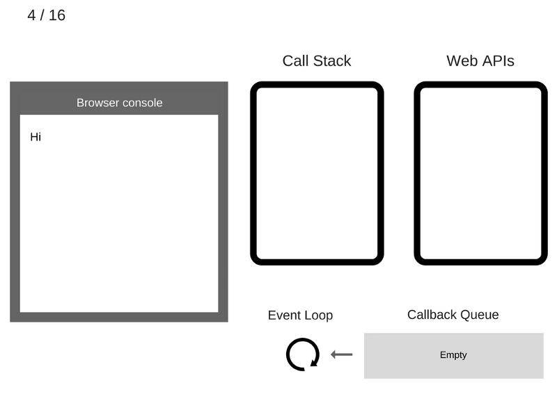
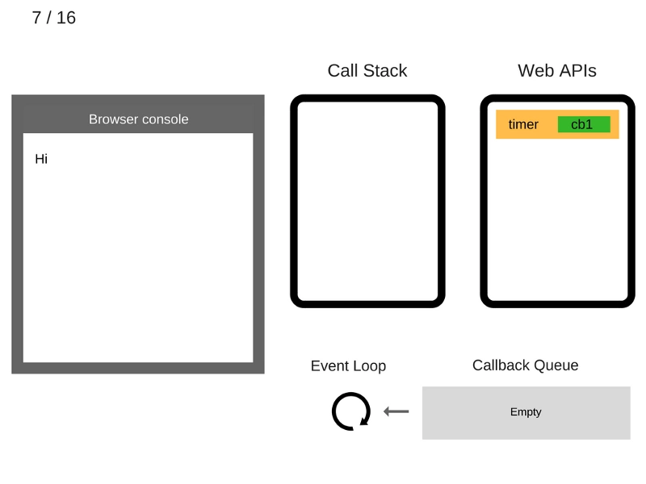
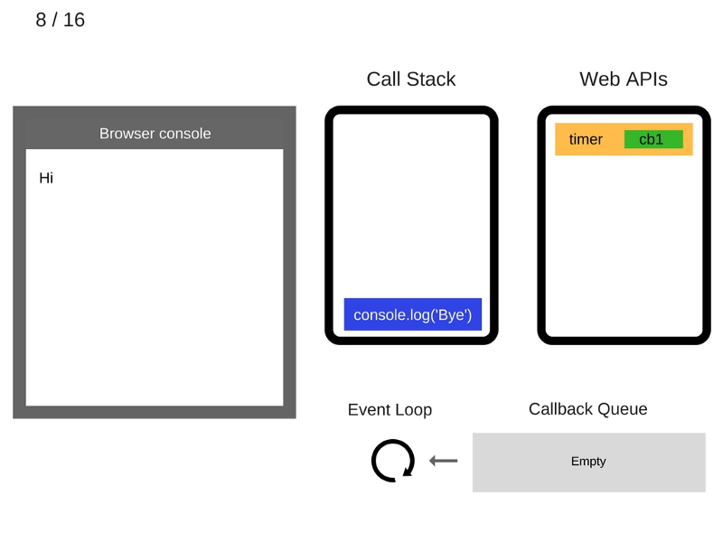
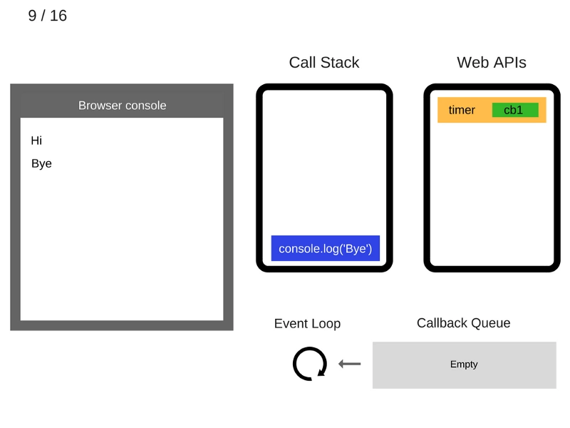
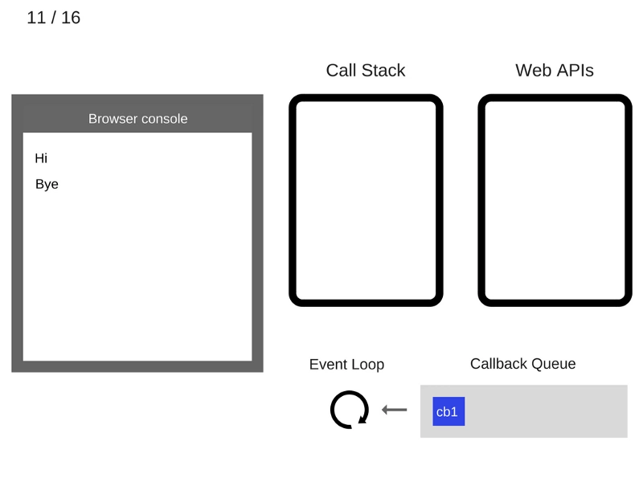
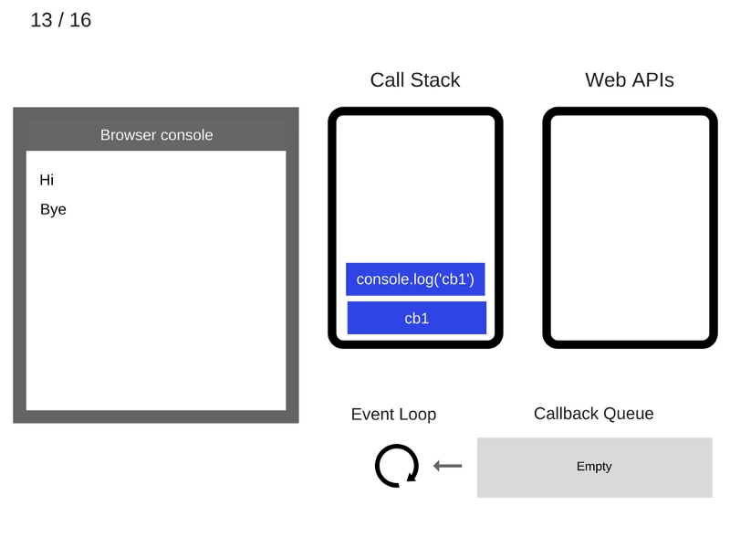
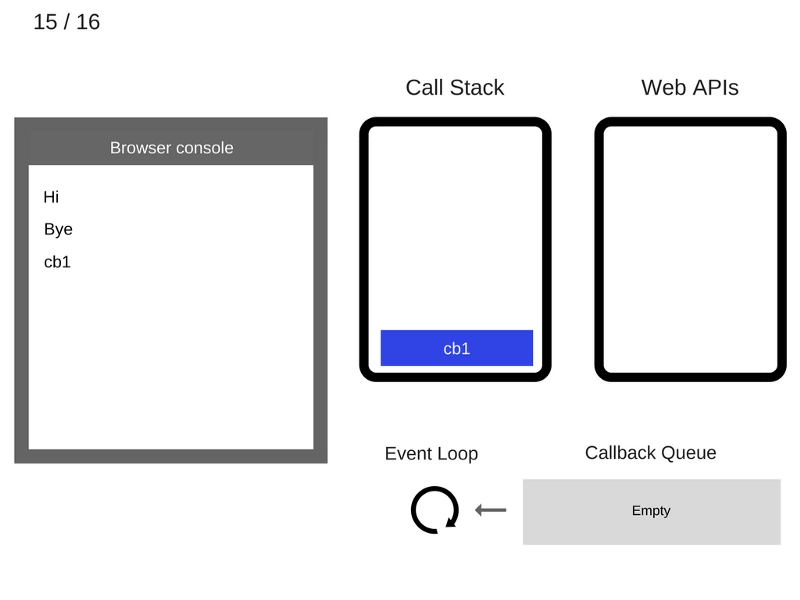
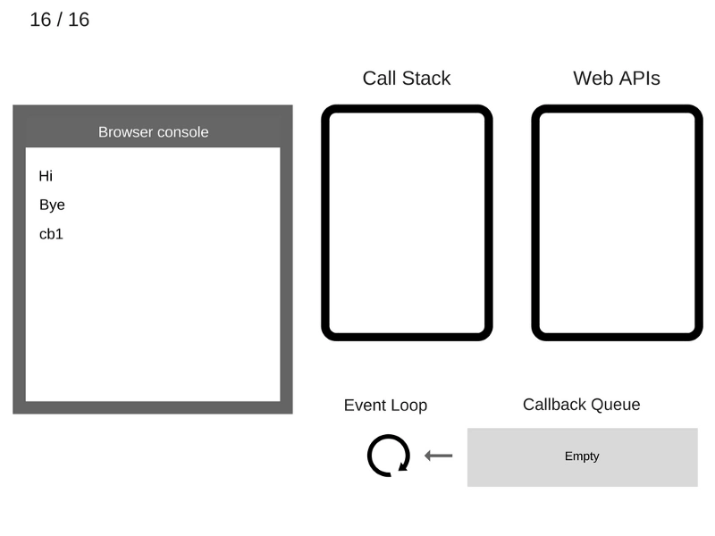
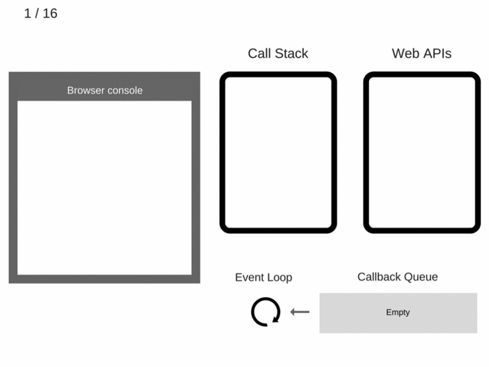

<br>

## 前言

在单线程环境中编程的缺陷以及如何解决这些缺陷来构建健壮的 JavaScript UI。按照惯例，在本文的最后，分享 5 个如何使用 async/ wait 编写更简洁代码的技巧。

## 关于作者

一个工作八年的草根程序员。

## 内容

- 为什么单线程是一个限制？
- JavaScript 程序的构建块
- 解析事件循环
- setTimeout(…) 是怎么工作的
- ES6 的任务队列是什么?
- 回调
- 嵌套回调
- Promise
- Promise Value
- 使用 Promise 还是不用？
- 吞掉错误或异常
- 处理未捕获异常
- ES8 中改进了什么 ?Async/await （异步/等待）
- 编写高度可维护性、非易碎异步代码的 5 个技巧

### 一、为什么单线程是一个限制？

当调用堆栈中有函数调用需要花费大量时间来处理时会发生什么？

例如，假设在浏览器中运行一个复杂的图像转换算法。

当调用堆栈有函数要执行时，浏览器不能做任何其他事情——它被阻塞了。这意味着浏览器不能渲染，不能运行任何其他代码，只是卡住了。那么你的应用 UI 界面就卡住了，用户体验就不那么好了。

在某些情况下，这可能不是主要的问题。还有一个更大的问题是一旦你的浏览器开始处理调用堆栈中的太多任务，它可能会在很长一段时间内停止响应。这时，很多浏览器会抛出一个错误，提示是否终止页面：


### 二、JavaScript 程序的构建块

你可能在单个.js 文件中编写 Javascript 应用程序，但可以肯定的是，你的程序由几个块组成，其中只有一个正在执行，其余的将在稍后执行。最常见的单元是函数。

大多数刚接触 JavaScript 的开发人员似乎都有这样的问题，就是认为所有函数都是同步完成，没有考虑异步的情况。如下例子：

```
// ajax 由某个库提供
var response = ajax('https://example.com/api');
console.log(response);

```

你可能知道标准 Ajax 请求不是同步的，这说明在代码执行时`Ajax(...)`函数还没有返回任何值来分配给变量`response`。

一种等待异步函数返回的结果简单的方式就是**回调函数**：

```
ajax('https://expamle.com/api',function(response){
    console.log(response);  // 'response' 现在可用
})

```

注意实际上可以设置同步 Ajax 请求，但记录不要那样做。如果设置同步 Ajax 请求，应用程序的界面将被阻塞——用户将无法单击、输入数据、导航或滚动。这将阻止任何用户交互，这是一种可怕的做法。

以下是同步 Ajax 地，但请千万不要这样做：

```
jQuery.ajax({
    url:'https://api.example.com/endpoint',
    success:function(response){
        //  处理一些事情
    },
    async:false // 这是一个可怕的想法
});

```

这里使用 Ajax 请求作为示例，你可以让任何代码块异步执行。

这可以通过 setTimerout(callback,milliseconds)函数来完成。setTimeout 函数的作用是设置一个架设函数 milliseconds 后执行，如下：

```
function first(){

}
```

输出：

```
first
third
second

```

### 三、解析事件循环

这里从一个有点奇怪的声明开始——尽管允许异步 Javascript 代码（就像上例讨论的 setTimeout）,但在 ES6 之前，JavaScript 本身实际上从来没有任何内置异步的概念，JavaScript 引擎在任何给定时刻只执行一个块。

那么，是谁告诉 JS 引擎执行程序的代码块呢？实际上，JS 引擎并不是单独运行的——它是在一个宿主环境中运行的，对于大多数开发人员来说，宿主环境就是典型的 web 浏览器或 Node.js。实际上，现在 JavaScript 被嵌入到各种各样的设备中，从机器人到灯泡，每个设备代表 JS 引擎的不同类型的托管环境。

所有环境中的共同点是一个称为**事件循环**的内置机制，它处理程序的多个块在一段时间内通过调用`JS`引擎的执行。

这意味着 JS 引擎只是任意 JS 代码的按需执行环境，是宿主环境处理事件运行及结果。

例如，当 JavaScript 程序发出 Ajax 请求从服务器获取一些数据时，在函数（“回调”）中设置“response”代码，JS 引擎告诉宿主环境：“我现在要推迟执行，但当完成那个网络请求时，会返回一些数据，请回调这个函数并给数据传给它”。

然后浏览器将侦听到的响应，当监听到网络请求返回内容时，浏览器通过将回调函数插入事件循环来调度要执行的回调函数。以下是示意图：


这些 Web api 是什么？从本质上说，它们是无法访问的线程，只能调用它们。它们是浏览器的迸发部分。如果你是一个 nodejs 开发者，这些就是 c++的 Api。

这样的迭代在事件循环中称为**(tick)标记**，每个事件只是一个函数回调。

```
console.log('Hi');

setTimeout(function cb1(){
    console.log('cb1');
},5000);

console.log('Bye');

```

让我们“执行”这段代码，看看会发生什么：

1. 初始化状态都为空，浏览器控制台是空的，调用堆栈也是空的


2. `console.log('Hi')`添加到调用堆栈中


3. 执行`console.log('Hi')`


4. `console.log('Hi')`从调用堆栈中移除



5. setTimeout(function cb1(){...}) 添加到调用堆栈


6. setTimeout(function cb1(){...})执行，浏览器创建一个计时器计时，这个作为 Web api 的一部分。


7. setTimeout(function cb1(){...})本身执行完成，并从调用堆栈中删除。



8. console.log('Bye')添加到调用堆栈



9. 执行 console.log('Bye')



10. console.log('Bye')从调用堆栈移除


11. 至少在 5 秒之后，计时器完成并将`cb1`回调堆到回调队列。



12. 事件循环从回调队列中获取 cb1 并将其推入调用堆栈。


13. 执行`cb1`并将`console.log('cb1')`添加到调用堆栈。



14. 执行`console.log('cb1')`


15. `console.log('cb1')`从调用堆栈中移除



16. `cb1`从调用堆栈中移除



**快速回顾**



值得注意的是，`ES6`指定了事件循环应该如何，这意味着在技术上它属于 JS 引擎的职责范围，不再仅仅扮演宿主环境的角色。这种变化的一个主要原因是`ES6`中引入了`Promises`，因为`ES6`需要对事件循环队列上的调度操作进行直接、细度的控制。

### 四、setTimeout(…) 是怎么工作的

需要注意的是，setTimeout(...)不会自动将架设放到事件循环队列中。它设置了一个计时器。当计时器过期时，环境将回调放到事件循环中，以便

```
setTimeout(myCallback,1000);

```

这并不意味着`myCallback`将在 1000 毫秒后就执行，而是在 1000 毫秒后，`myCallback`被添加到队列中。但是，如果队列有其他事件在前面添加回调刚必须等待前后的执行前后的执行后在执行`myCallback`。

有不少的文章和教程上开始使用异步 Javascript

```
console.log('Hi');
setTimeout(function(){
    console.log('callback');
},0);
console.log('Bye');

```

虽然等待时间被设置为 0ms，但在浏览器控制台的结果如下：

```
Hi
Bye
callback
```

### 五、ES6 的任务队列是什么?

`ES6`中引入了一个名为"任务队列"的概念。它是事件循环队列上的一个层。最为常见在`Promise`处理的异步方式。

现在只讨论这个概念，以便在讨论带有`Promises`的异步行为时，能够了解 Promises 是如何调度和处理。

想你一下：任务队列是一个附加到事件循环队列中每个标记末尾的队列。某些异步操作可能发生在事件循环的一个标记期间，不会导致一个全新的事件被添加到事件循环队列中。而是将一个项目(即任务)添加到当前标记的任务队列的末尾。

这意味着可以放心添加另一个功能以便稍后执行，它将在其他任何事情之前立即执行。

任务还可能创建更多任务添加到同一队列的末尾。理论上，任务“循环”（不断添加其他任务等等）可以无限运行，从而使程序无法获得转移到下一个事件循环票房的必要资源。从概念上讲，这类似于在代码中表示长时间运行或无限循环(如 while(true)..)。

任务有点像 setTimeout(callback,0) "hack"，但其实现方式是引入一个定义更明确、更有保证的顺序：稍后，但越快越好。

### 六、回调

正如你已经知道的，回调是到目前为止`JavaScript`程序中表达和管理异步最常见的方法。实际上，回调是`JavaScript`语言中最基本的异步模式。无数的`JS`程序，甚至是非常复杂的程序，除了一些基本都是在回调异步基础上编写的。

然而回调方式还是有一些缺点，许多开发人员都在试图找到更好的异步模式。但是，如果不了解底层的内容，就不可能有效地使用任何抽象出来的异步模式。

在下一章中，我们将深入探讨这些抽象，以说明为什么更复杂的异步模式(将在后续文章中讨论)是必要的，甚至是值得推荐的。

### 七、嵌套回调

### 八、Promise

### 九、使用 Promise 还是不用？

### 十、吞掉错误或异常

### 十一、处理未捕获异常

### 十二、ES8 中改进了什么 ?Async/await （异步/等待）

### 十三、编写高度可维护性、非易碎异步代码的 5 个技巧

- 简介代码
- 错误处理
- 条件
- 堆栈帧
- 调试

#### 13.1 简介代码

使用 async/await 可以编写更少的代码。每次使用 async/await 时，都会路过一些不必要的步骤：使用 then，创建一个匿名函数来处理响应，例如：

```
// rp是一个请求Promise函数。
rp('https://api.example.com/endpoint1').then(function(data){

});

```

和：

```
// `rp` is a request-promise function.

var response = await rp(‘https://api.example.com/endpoint1');

```

#### 13.2 错误处理

Async/wait 可以使用相同的代码结构（众所周知的 try/catch 语句）处理同步和异步错误。看看它是如何与 Promise 结合的

```
function loadData(){
    try{
        getJSON().then(function(response){
            var parsed = JSON.parse(response);
            console.log(parsed);
        }).catch(function(e){
            console.log(e);
        })
    }catch(e){
        console.log(e);
    }
}

```

与

```
async function loadData(){
    try{
        var data = JSON.parse(await getJSON());
        console.log(data);
    }catch(e){
        console.log(e);
    }
}

```

#### 13.3 条件

用 async/wait 编写代码要简单得多

```
function loadData(){
    return getJSON().then(function(response){
        if(response.needsAnotherRequest){
            return makeAnotherRequest(response).then(function(anotherResponse){
                console.log(anotherResponse);
                return anotherResponse;
            })
        }else{
            console.log(response)
            return response;
        }
    })
}

```

与

```
async function loadData(){
    var response = await getJSON();
    if(response.needsAnotherRequest){
        var anotherResponse = await makeAnotherRequest(response);
        console.log(anotherResponse);
        return anotherResponse;
    }else{
        console.log(response);
        return response;
    }
}

```

#### 13.4 堆栈帧

与 async/await 不同，从 Promise 链返回的错误堆栈不提供错误发生在哪里。看下面这些

```
function loadData(){
    return callAPromise().then(callback1).then(callback2).then(callback3).then(()=>{
        throw new Error('boom');
    })
}

loadData().catch(function(e){
    console.log(err);
});

```

与：

```
async function loadData(){
    await callAPromise1();
    await callAPromise2();
    await callAPromise3();
    await callAPromise4();
    await callAPromise5();
    throw new Error('boom');
}

loadData.catch(function(e){
    cosnole.log(e);
})

```

#### 13.1 调试

如果你使用过 Promise，那么你知道调试它们是一场噩梦。例如，如果在一个程序中设置了一个断点，然后阻塞并使用高度快捷方式（如“停止”），调试器将不会移动到下面，因为它只“逐步”执行同步代码。使用`async/wait`，您可以逐步完成`wait`调用，就像它们是正常的同步函数一样。

### 参考资料

- [JavaScript 是如何工作的:事件循环和异步编程的崛起+ 5 种使用 async/await 更好地编码方式！](https://github.com/qq449245884/xiaozhi/issues/4)

## 联系作者

<div align="center">
    <p>
        平凡世界，贵在坚持。
    </p>
    
</div>
