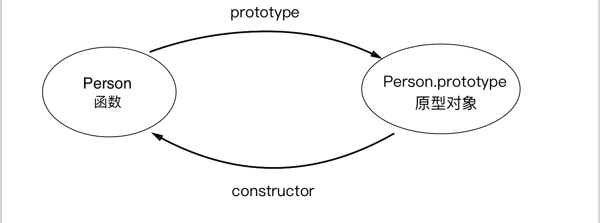
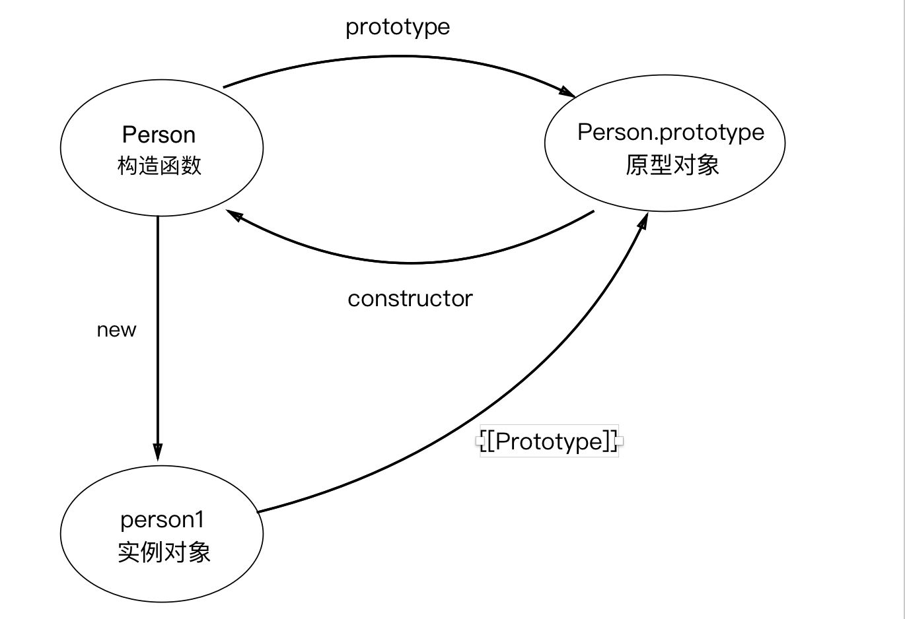
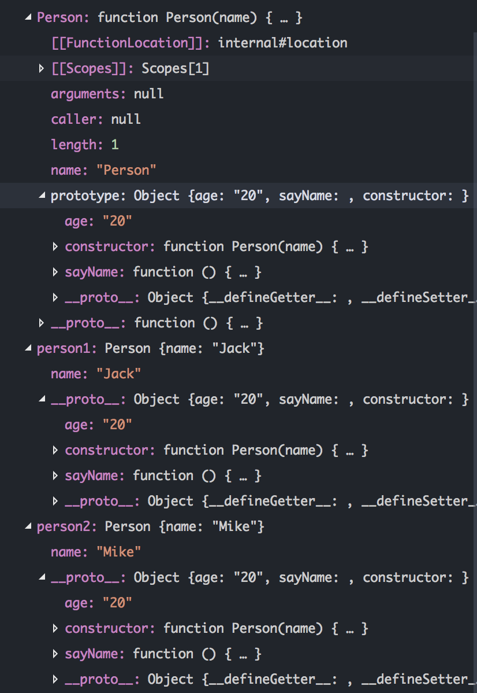
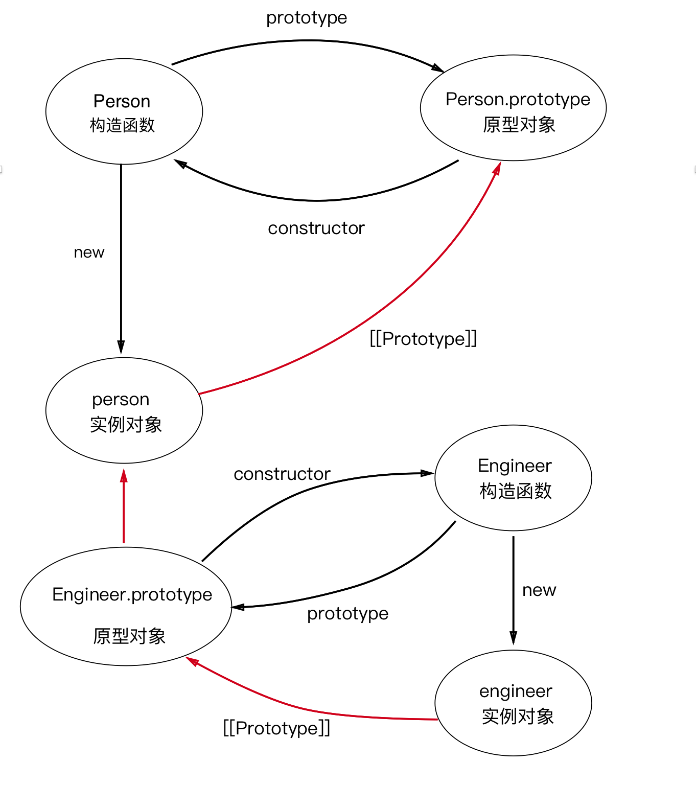
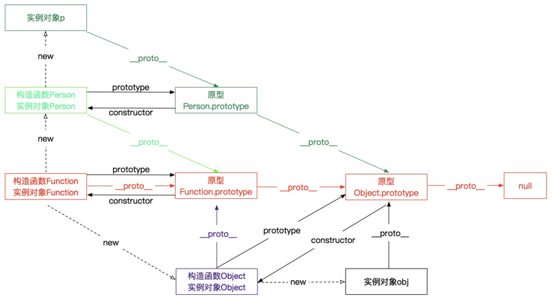

<br>

## 前言

本人平时学习及收集内容，欢迎参入一起讨论。

## 关于作者

一个工作八年的草根程序员。

## 主要内容

- [原型](#一原型)
- [原型链](#二原型链)
- [完整的原型链](#三完整的原型链)

### 一、原型

#### 1.1 原型是什么？

在我们深入探索之前，当然要先了解原型是什么了，不然一切都无从谈起。谈起原型，那得先从对象说起，且让我们慢慢说起。

我们都知道，JavaScript 是一门基于对象的脚本语言，但是它却没有类的概念，所以 JavaScript 中的对象和基于类的语言（如 Java）中的对象有所不同。JavaScript 中的对象是无序属性的集合，其属性可以包含基本值，对象或者函数，听起来更像是键值对的集合，事实上也比较类似。有了对象，按理说得有继承，不然对象之间没有任何联系，也就真沦为键值对的集合了。那没有类的 JavaScript 是怎么实现继承的呢？

我们知道，在 JavaScript 中可以使用构造函数语法（通过 new 调用的函数通常被称为构造函数）来创建一个新的对象，像下面这样：

``` 

// 构造函数，无返回值
function Person(name) {
  this.name = name;
}
// 通过 new 新建一个对象
var person = new Person('Mike');

```

这和一般面向对象编程语言中创建对象（Java 或 C++）的语法很类似，只不过是一种简化的设计，`new` 后面跟的不是类，而是构造函数。这里的构造函数可以看做是一种类型，就像面向对象编程语言中的类，但是这样创建的对象除了属性一样外，并没有其他的任何联系，对象之间无法共享属性和方法。每当我们新建一个对象时，都会方法和属性分配一块新的内存，这是极大的资源浪费。考虑到这一点，JavaScript 的设计者 Brendan Eich 决定为构造函数设置一个属性。这个属性指向一个对象，所有实例对象需要共享的属性和方法，都放在这个对象里面，那些不需要共享的属性和方法，就放在构造函数里面。实例对象一旦创建，将自动引用这个对象的属性和方法。也就是说，实例对象的属性和方法，分成两种，一种是本地的，不共享的，另一种是引用的，共享的。这个对象就是原型（prototype）对象，简称为原型。

我们创建的每个函数都有一个 prototype（原型）属性，这个属性是一个指针，指向一个对象，这个对象就是调用构造函数而创建的对象实例的原型。原型可以包含所有实例共享的属性和方法，也就是说只要是原型有的属性和方法，通过调用构造函数而生成的对象实例都会拥有这些属性和方法。看下面的代码：

``` 

function Person(name) {
  this.name = name;
}

Person.prototype.age = '20';
Person.prototype.sayName = function() {
  console.log(this.name);
}

var person1 = new Person('Jack');
var person2 = new Person('Mike');

person1.sayName(); // Jack
person2.sayName(); // Mike
console.log(person1.age); // 20
console.log(person2.age); // 20

```

这段代码中我们声明了一个 `Person` 函数，并在这个函数的原型上添加了 `age` 属性和 `sayName` 方法，然后生成了两个对象实例 `person1` 和 `person2`，这两个实例分别拥有自己的属性 `name` 和原型的属性 `age` 以及方法 `sayName`。所有的实例对象共享原型对象的属性和方法，那么看起来，原型对象就像是类，我们就可以用原型来实现继承了。

#### 1.2 constructor 与 [[Prototype]]

我们知道每个函数都有一个 prototype 属性，指向函数的原型，因此当我们拿到一个函数的时候，就可以确定函数的原型。反之，如果给我们一个函数的原型，我们怎么知道这个原型是属于哪个函数的呢？这就要说说原型的 constructor 属性了：

>在默认情况下，所有原型对象都会自动获得一个 constructor （构造函数）属性，这个属性包含一个指向 prototype 属性所在函数的指针。

也就是说每个原型都有都有一个 constructor 属性，指向了原型所在的函数，拿前面的例子来说 Person.prototype.constructor 指向 Person。下面是构造函数和原型的关系说明图：



继续，让我们说说 `[[prototype]]`。

当我们调用构造函数创建一个新的实例（新的对象）之后，比如上面例子中的 `person1`，实例的内部会包含一个指针（内部属性），指向构造函数的原型。ECMA-262 第 5 版中管这个指针叫[[Prototype]]。我们可与更新函数和原型的关系图：



不过在脚本中没有标准的方式访问 [[Prototype]] ， 但在 Firefox、Safari 和 Chrome 中可以通过 `__proto__`属性访问。而在其他实现中，这个属性对脚本则是完全不可见的。不过，要明确的真正重要的一点就是，这个连接存在于实例与构造函数的原型对象之间，而不是存在于实例与构造函数之间。

在 VSCode 中开启调试模式，我们可以看到这些关系：



从上图中我们可以看到 `Person` 的 `prototype` 属性和 `person1` 的 `__proto__` 属性是完全一致的，`Person.prototype` 包含了一个 `constructor` 属性，指向了 `Person` 函数。这些可以很好的印证我们上面所说的构造函数、原型、`constructor` 以及 `__proto__` 之间的关系。

#### 1.3 对象实例与原型

了解完构造函数，原型，对象实例之间的关系后，下面我们来深入探讨一下对象和原型之间的关系。

#### 1.4 判断对象实例和原型之间的关系

因为我们无法直接访问实例对象的 `__proto__` 属性，所以当我们想要确定一个对象实例和某个原型之间是否存在关系时，可能会有些困难，好在我们有一些方法可以判断。

我们可以通过 `isPrototypeOf()` 方法判断某个原型和对象实例是否存在关系，或者，我们也可以使用 ES5 新增的方法 `Object.getPrototypeOf()` 获取一个对象实例 `__proto__` 属性的值。看下面的例子：

``` 
    console.log(Person.prototype.isPrototypeOf(person1)); // true
    console.log(Object.getPrototypeOf(person1) == Person.prototype); // true

```

#### 1.5 对象实例属性和方法的获取

每当代码读取某个对象的某个属性时，都会执行一次搜索，目标是具有给定名字的属性。搜索首先从对象实例本身开始。如果在实例对象中找到了具有给定名字的属性，则返回该属性的值。如果没有找到，则继续搜索 `__proto__` 指针指向的原型对象，在原型对象中查找具有给定名字的属性，如果在原型对象中找到了这个属性，则返回该属性的值。如果还找不到，就会接着查找原型的原型，直到最顶层为止。这正是多个对象实例共享原型所保存的属性和方法的基本原理。

虽然可以通过对象实例访问保存在原型中的值，但却不能通过对象实例重写原型中的值。我们在实例中添加的一个属性，会屏蔽原型中的同名属性。另外，通过 `hasOwnProperty` 方法能判断对象实例中是否存在某个属性（不能判断对象原型中是否存在该属性）。来看下面的例子：

``` 
    JavaScript
    function Person(){ }

    Person.prototype.name = 'Nicholas';
    Person.prototype.age = 29;
    Person.prototype.job = 'Software Engineer';
    Person.prototype.sayName = function(){ console.log(this.name); };

    var person1 = new Person();
    var person2 = new Person();

    // 注意，此处不能用 name，因为函数本身存在 name 属性
    console.log(person1.hasOwnProperty('age')); // false
    console.log(Person.hasOwnProperty('age')); // false
    person1.name = 'Greg';
    console.log(person1.hasOwnProperty('name')); // true
    console.log(person1.name); //"Greg"——来自实例
    console.log(person2.name); //"Nicholas"——来自原型
```

#### 1.6 in 操作符

有两种方式使用 in 操作符：

- 单独使用

>在单独使用时，in 操作符会在通过对象能够访问给定属性时返回 true，无论该属性存在于实例中还是原型中。

- for-in 循环中使用

>在使用 for-in 循环时，返回的是所有能够通过对象访问的、可枚举的（enumerated）属性，其中既包括存在于实例中的属性， 也包括存在于原型中的属性。如果需要获取所有的属性（包括不可枚举的属性），可以使用 Object.getOwnPropertyNames() 方法。

看下面的例子：

``` 
    JavaScript
    function Person(){
    this.name = 'Mike';
    }

    Person.prototype.age = 29;
    Person.prototype.job = 'Software Engineer';
    Person.prototype.sayName = function(){ console.log(this.name); };

    var person = new Person();

    for(var item in person) {
    console.log(item); // name age job sayName
    }

    console.log('name' in person); // true - 来自实例
    console.log('age' in person); //  true - 来自原型
```

#### 1.7 原型的动态性

由于在对象中查找属性的过程是一次搜索，而实例与原型之间的连接只不过是一个指针，而非一个副本，因此我们对原型对象所做的任何修改都能够立即从实例上反映出来——即使是先创建了实例后修改原型也照样如此：

``` 

    JavaScript
    var person = new Person();

    Person.prototype.sayHi = function(){ console.log("hi"); };
    person.sayHi(); // "hi"

```

上面的代码中，先创建了 `Person` 的一个实例，并将其保存在 `person` 中。然后，下一条语句在 `Person.prototype` 中添加了一个方法 `sayHi()`。即使 `person` 实例是在添加新方法之前创建的，但它仍然可以访问这个新方法。在调用这个方法时，首先会查找 `person` 实例中是否有这个方法，发现没有，然后到 `person` 的原型对象中查找，原型中存在这个方法，查找结束。；

但是下面这种代码所得到的结果就完全不一样了：

``` 
    JavaScript
    function Person() {}

    var person = new Person();

    Person.prototype = {
    constructor: Person,
    name: "Nicholas",
    age: 29,
    job: "Software Engineer",
    sayName: function () {
        console.log(this.name);
    }
    };

    person.sayName(); // error
```

仔细观察上面的代码，我们直接用对象字面量语法给 `Person.prototype` 赋值，这似乎没有什么问题。但是我们要知道字面量语法会生成一个新的对象，也就是说这里的 `Person.prototype` 是一个新的对象，和 `person` 的 `__proto__` 属性不再有任何关系了。此时，我们再尝试调用 `sayName` 方法就会报错，因为 `person` 的 `__proto__` 属性指向的还是原来的原型对象，而原来的原型对象上并没有 `sayName` 方法，所以就会报错。

### 二、原型链

#### 2.1 原型的原型

在前面的例子，我们是直接在原型上添加属性和方法，或者用一个新的对象赋值给原型，那么如果我们让原型对象等于另一个类型的实例，结果会怎样呢？

``` 
JavaScript
function Person() {
  this.age = '20';
}

Person.prototype.weight = '120';

function Engineer() {
  this.work = 'Front-End';
}

Engineer.prototype = new Person();

Engineer.prototype.getAge = function() {
  console.log(this.age);
}

var person = new Person();
var engineer = new Engineer();

console.log(person.age); // 20
engineer.getAge(); // 20
console.log(engineer.weight); // 120
console.log(Engineer.prototype.__proto__ == Person.prototype); // true
```

在上面代码中，有两个构造函数 `Person` 和 `Engineer`，可以看做是两个类型，`Engineer` 的原型是 `Person` 的一个实例，**也就是说 `Engineer` 的原型指向了 `Person` 的原型**（注意上面的最后一行代码）。然后我们分别新建一个 `Person` 和 `Engineer` 的实例对象，可以看到 `engineer` 实例对象能够访问到 `Person` 的 `age` 和 `weight` 属性，这很好理解：`Engineer` 的原型是 `Person` 的实例对象，`Person` 的实例对象包含了 `age` 属性，而 `weight` 属性是 `Person` 原型对象的属性，`Person` 的实例对象自然可以访问原型中的属性，同理，`Engineer` 的实例对象 `engineer` 也能访问 `Engineer` 原型上的属性，间接的也能访问 `Person` 原型的属性。

看起来关系有些复杂，不要紧，我们用一张图片来解释这些关系：



是不是一下就很清楚了，顺着图中红色的线，`engineer` 实例对象可以顺利的获取 `Person` 实例的属性以及 `Person` 原型的属性。至此，已经铺垫的差不多了，我们理解了原型的原型之后，也就很容易理解原型链了。

#### 2.2 原型链

原型链其实不难理解，上图中的红色线组成的链就可以称之为原型链，只不过这是一个不完整的原型链。我们可以这样定义原型链：
>原型对象可以包含一个指向另一个原型（原型2）的指针，相应地，另一个原型（原型2）中也可以包含着一个指向对应构造函数（原型2 的构造函数）的指针。假如另一个原型（原型2）又是另一个类型（原型3 的构造函数）的实例，那么上述关系依然成立，如此层层递进，就构成了实例与原型的链条。这就是所谓原型链的基本概念。

结合上面的图，这个概念不难理解。上面的图中只有两个原型，那么当有更多的原型之后，这个红色的线理论上可以无限延伸，也就构成了原型链。

通过实现原型链，本质上扩展了前面提到过的原型搜索机制：当以读取模式访问一个实例的属性时，首先会在实例中搜索该属性。如果没有找到该属性，则会继续搜索实例的原型。在通过原型链实现继承的情况下，搜索过程就得以沿着原型链继续向上。在找不到属性或方法的情况下，搜索过程总是要一环一环地前行到原型链末端才会停下来。

那么原型链的末端又是什么呢？我们要知道，所有函数的 `默认原型` 都是 Object 的实例，因此默认原型都会包含一个内部指针，指向 `Object.prototype`。我们可以在上面代码的尾部加上一行代码进行验证：

``` 
JavaScript
console.log(Person.prototype.__proto__ == Object.prototype); // true
```

那 `Object.prototype` 的原型又是什么呢，不可能没有终点啊？聪明的小伙伴可能已经猜到了，没错，就是 `null`，null 表示此处不应该有值，也就是终点了。我们可以在 Chrome 的控制台或 Node 中验证一下：

``` 
JavaScript
console.log(Object.prototype.__proto__); // null
```

#### 2.3 实例方法

Constructor：保存着用于创建当前对象的函数。

hasOwnProperty(propertyName)：用于检查给定的属性在当前对象实例中（而不是在实例的原型中）是否存在。其中，作为参数的属性名（propertyName）必须以字符串形式指定(例如：o.hasOwnProperty(“name”))

isPrototypeOf(object)：用于检查传入的对象是否是另一个对象的原型。

toLocaleString() ：返回对象的字符串表示，该字符串与执行环境的地区对应。

toString() ：返回对象的字符串表示。

valueOf() ：返回对象的字符串、数值或布尔值表示。通常与 toString() 方法的返回值相同。

instanceof 用来判断一个构造函数的prototype属性所指向的对象是否存在另外一个要检测对象的原型链上

### 完整的原型链



### 参考资料

- 《JavaScript 高级程序设计》
- [Javascript深入之从原型到原型链](https://github.com/mqyqingfeng/Blog/issues/2)
- [深入理解JavaScript之从原型到原型链](https://juejin.im/post/5a0a5dc4f265da430b7abffb?utm_source=gold_browser_extension)
- [原型图解](https://segmentfault.com/a/1190000011880268)

## 联系作者

<div align="center">
    <p>
        在颠覆世界的同时，也要好好关照自己。
    </p>
    
</div>
