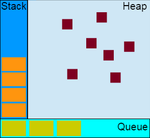
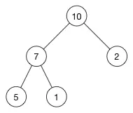
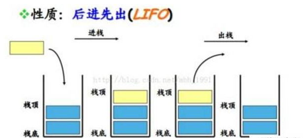
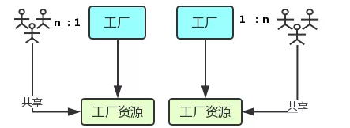

 

## 前言

`Event Loop`即事件循环，是指浏览器或`Node`的一种解决`javaScript`单线程运行时不会阻塞的一种机制，也就是我们经常使用**异步**的原理。

## 关于作者

一个工作八年的草根程序员。

## 内容

- 堆，栈、队列
- 线程与进程
- Event Loop
- 浏览器中的Event Loop
- 例子
- NodeJS的Event Loop

### 一、堆，栈、队列

- 堆
- 栈
- 队列

#### 1.1 堆

**堆**是一种数据结构，是利用完全二叉树维护的一组数据，堆分为两种，一种为最大**堆**，一种为最小**堆**，将根节点**最大**的**堆**叫做**最大堆**或**大根堆**，根节点**最小**的**堆**叫做**最小堆**或**小根堆**。

**堆**是**线性数据结构**，相当于**一维数组**，有唯一后继。

如最大堆

#### 1.2 栈

**栈**在计算机科学中是限定仅在**表尾**进行**插入**或**删除**操作的线性表。**栈**是一种数据结构，它按照**后进先出**的原则存储数据，**先进入**的数据被压入**栈底**，**最后的数据在栈顶**，需要读数据的时候从**栈顶**开始**弹出数据**。

**栈**是只能在**某一端插入**和**删除**的**特殊线性表**。

#### 1.3 队列

特殊之处在于它只允许在表的前端进行**删除**操作，而在表的后端进行**插入**操作，和**栈**一样，**队列**是一种操作受限制的线性表。

进行**插入**操作的端称为**队尾**，进行**删除**操作的称为**队头**。队列中没有元素时，称为**空队列**。

**队列**的数据元素又称为**队列元素**。在队列中插入一个队列元素称为**入队**，从**队列**中一个队列歹毒称为**出队**。因为队列**只允许**在一端**插入**，在另一端**删除**，所以只有**最早**进入**队列**的元素**才能最先从队列中**删除，故队列又称为**先进先出**。

### 二、线程与进程

官方的说法是：进程是 CPU资源分配的最小单位；线程是 CPU调度的最小单位。

这两句话并不好理解，我们先来看张图：

- 进程好比图中的工厂，有单独的专属自己的工厂资源。
- 线程好比图中的工人，多个工人在一个工厂中协作工作，工厂与工人是1:n的关系。也就是说**一个进程由一个或多个线程组成，线程是一个进程中代码的不同执行路线**；
- 工厂空间是工厂共享的，这象征一个进程的内在空间是共享的，每个线程都可用这些共享内存。
- 多个工厂之间独立存在。

### 三、Event Loop

在`JavaScript`中，任务被分为两种，一种宏任务（`MacroTask`）也叫`Task`，一种叫微任务（`MicroTask`）。

- MacroTask（宏任务）
- MicroTask（微任务）

#### 3.1 MacroTask（宏任务）

- `script`全部代码、`setTimeout`、`setInterval`、`setImmediate`（浏览器暂时不支持，只有IE10支持，具体可见MDN）、`I/O`、`UI Rendering`。

#### 3.2 MicroTask（微任务）

- `Process.nextTick(node独有)`、`Promise`、`Object.observe(废弃)`、`MutationObserver`（具体使用方式查看[这里](http://javascript.ruanyifeng.com/dom/mutationobserver.html）

### 四、浏览器中的Event Loop

`Javascript`有一个`main thread`主线程和`call-stack`调用栈(执行栈)，所有的任务都会被放到调用栈等待主线程执行。

- JS调用栈
- 同步任务和异步任务
- 事件循环的进程模型

#### 3.1 JS调用栈

JS调用栈采用的是后进先出的规则，当函数执行的时候，会被添加到栈的顶部，当执行完后，就会从栈顶移出，直到栈内被清空。

#### 3.2 同步任务和异步任务

`JavaScript`单线程任务被分为**同步任务**和**异步任务**，同步任务会在调用栈中按照顺序等待主线程依次执行，异步任务会在异步任务有了结果后，将注册的回调函数放入任务队列中等待主线程空闲的时候（调用栈被清空），被读取到栈内等待主线程的执行。

任务队列`Task Queue`，即队列，是一种先进先出的一种数据结构。

#### 3.3 事件循环的进程模型

### 四、例子

### NodeJS的Event Loop

### 总结

### 参考资料

- [一次弄懂Event Loop（彻底解决此类面试问题）](https://juejin.im/post/5c3d8956e51d4511dc72c200)
- [Event Loop](https://juejin.im/book/5bdc715fe51d454e755f75ef/section/5be04a8e6fb9a04a072fd2cd)
- [从浏览器多进程到JS单线程，JS运行机制最全面的一次梳理](https://juejin.im/post/5a6547d0f265da3e283a1df7)
- [浏览器与Node的事件循环(Event Loop)有何区别?](https://github.com/ljianshu/Blog/issues/54)
- [这一次，彻底弄懂 JavaScript 执行机制](https://juejin.im/post/59e85eebf265da430d571f89)
- [详解JavaScript中的Event Loop（事件循环）机制](https://zhuanlan.zhihu.com/p/33058983)

## 联系作者

    

        平凡世界，贵在坚持。
    

    

