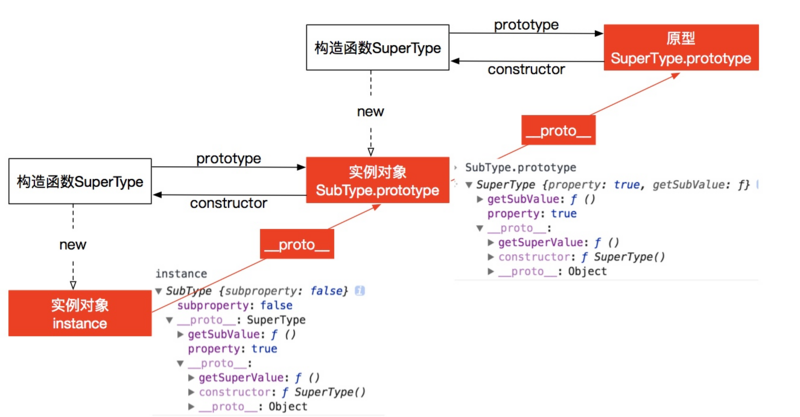

## 内容

- [原型链继承](#一原型链继承)
- [借用构造函数继承](#二借用构造函数继承)
- [组合继承](#三组合继承)
- [原型式继承](#四原型式继承)
- [寄生式继承](#五寄生式继承)
- [寄生组合式继承](#六寄生组合式继承)
- [混入方式继承多个对象](#七混入方式继承多个对象)
- [ES6类继承extends](#八ES6类继承extends)

### 一、原型链继承

构造函数、原型和实例之间的关系：每个构造函数都有一个原型对象，原型对象都包含一个指向构造函数的指针，而实例都包含一个原型对象的指针。

```
function SuperType() {
    this.property = true;
}

SuperType.prototype.getSuperValue = function() {
    return this.property;
}

function SubType() {
    this.subproperty = false;
}

// 这里是关键，创建SuperType的实例，并将该实例赋值给SubType.prototype
SubType.prototype = new SuperType(); 

SubType.prototype.getSubValue = function() {
    return this.subproperty;
}

var instance = new SubType();
console.log(instance.getSuperValue()); // true

```


注意：不能使用对象字面量创建原型方法。

```
function SuperType(){
    this.property=true;
}

SuperType.prototype.getSuperValue=function(){
    return this.property;
};

function SubType(){
    this.subproperty=false;
}

//继承了SuperType
SubType.prototype=new SuperType();

// 使用字面量添加新方法，会导致上一行代码无效
SubType.prototype={
    getSubValue:function(){
        return this.subproperty;
    },
    someOtherMethod:function(){
        return false;
    }
};

var instance=new SubType();
alert(instance.getSuperValue());    // error!

```

原型链方案存在的缺点

- 多个实例对引用类型的操作会被篡改
- 不能向超类型的构造函数中传递参数

```

function SuperType(){
    this.colors=["red","blue","green"];
}
function SubType(){}

SubType.prototype=new SuperType();

var instance1=new SubType();
instance1.colors.push('black');
alert(instance1.colors); //"red,blue,green,black"

var instance2 = new SubType(); 
alert(instance2.colors); //"red,blue,green,black"

```

### 二、借用构造函数继承

在子类型构造函数中内部调用超类型构造函数。通过使用apply()和call()方法执行构造函数。

```
    function  SuperType(){
        this.color=["red","green","blue"];
    }
    function  SubType(){
        //继承自SuperType
        SuperType.call(this);
    }
    var instance1 = new SubType();
    instance1.color.push("black");
    alert(instance1.color);//"red,green,blue,black"

    var instance2 = new SubType();
    alert(instance2.color);//"red,green,blue"

```

缺点：

- 只能继承父类的实例属性和方法，不能继承原型属性/方法
- 无法实现利用，每个子类都有父类实例函数的副本，影响性能

### 三、组合继承

组合继承指的是将原型链和借用构造函数的技术组合到一块，从而发挥二者之长的一种继承模式。用原型链实现对原型属性和方法的继承，用借用构造函数的技术来实现实例属性的继承。

```

    function SuperType(name){
    this.name = name;
    this.colors = ["red", "blue", "green"];
    }
    SuperType.prototype.sayName = function(){
    alert(this.name);
    };

    function SubType(name, age){
    // 继承属性
    // 第二次调用SuperType()
    SuperType.call(this, name);
    this.age = age;
    }

    // 继承方法
    // 构建原型链
    // 第一次调用SuperType()
    SubType.prototype = new SuperType(); 
    // 重写SubType.prototype的constructor属性，指向自己的构造函数SubType
    SubType.prototype.constructor = SubType; 
    SubType.prototype.sayAge = function(){
        alert(this.age);
    };

    var instance1 = new SubType("Nicholas", 29);
    instance1.colors.push("black");
    alert(instance1.colors); //"red,blue,green,black"
    instance1.sayName(); //"Nicholas";
    instance1.sayAge(); //29

    var instance2 = new SubType("Greg", 27);
    alert(instance2.colors); //"red,blue,green"
    instance2.sayName(); //"Greg";
    instance2.sayAge(); //27

```

优点：融合原型链继承和构造函数的优点，是 JavaScript 中最常用的继承模式。

### 四、原型式继承

```
function createObj(obj){
    function F(){}
    F.prototype=obj;
    return new F();
}

```

缺点：

- 引用类型的属性值始终都会共享相应的值，存在篡改的可能。
- 无法传递参数

```
    var person = {
        name: 'kevin',
        friends: ['daisy', 'kelly']
    }

    var person1 = createObj(person);
    var person2 = createObj(person);

    person1.name = 'person1';
    console.log(person2.name); // kevin

    person1.firends.push('taylor');
    console.log(person2.friends); // ["daisy", "kelly", "taylor"]

```

### 五、寄生式继承

```

function createAnother(original){
    var clone=object(original);     //通过调用object()函数创建一个新对象
    clone.sayHi=function(){     // 以某种方式来增强对象
        console.log('hi');
    };
    return clone;   //返回这个对象
}

```

注意：修改`person1.name`的值，`person2.name`的值并未发生改变，并不是因为`person1`和`person2`有独立的 `name` 值，而是因为`person1.name = 'person1'`，给`person1`添加了 `name` 值，并非修改了原型上的 `name` 值。

### 六、寄生组合式继承

```
function inheritPrototype(subType,superType){
    var prototype=Object.create(superType.prototype);   // 创建对象，创建父类原型的一个副本
    prototype.constructor=subType;  // 增加对象，弥补因重写原型而推动的默认的constructor
    subType.prototype=prototype;
}

// 父类初始化实例属性和原型属性
function SuperType(name){
    this.name=name;
    this.colors=['red','blue','green'];
}
SuperType.prototype.sayName=function(){
    alert(this.name);
};

// 借用构造函数传递增强子类实例属性（支持传参和避免篡改）
function SubType(name,age){
    SuperType.call(this,name);
    this.age=age;
}

// 将父类原型指向子类
inheritPrototype(SubType, SuperType);

// 新增子类原型属性
SubType.prototype.sayAge = function(){
  alert(this.age);
}

var instance1 = new SubType("xyc", 23);
var instance2 = new SubType("lxy", 23);

instance1.colors.push("2"); // ["red", "blue", "green", "2"]
instance2.colors.push("3"); // ["red", "blue", "green", "3"]
```

### 七、混入方式继承多个对象

```
function MyClass(){
    SuperClass.call(this);
    OtherSuperClass.call(this);
}

// 继承一个类
MyClass.prototype=Object.create(SuperClass.prototype);
// 混合其它
Object.assign(MyClass.prototype, OtherSuperClass.prototype);
// 重新指定constructor
MyClass.prototype.constructor = MyClass;

MyClass.prototype.myMethod = function() {
     // do something
};
```

### 八、ES6类继承extends

```
class Rectangle{
    // constructor
    constructor(height,width){
        this.height = height;
        this.width = width;
    }

    // Getter
    get area(){
        return this.calcArea()
    }

    // Method
    calcArea(){
        return this.height * this.width;
    }
}

const rectangle=new Rectangle(10,20);
console.log(rectangle.area);
// 输出200

//继承
class Square extends Rectangle{
    constructor(length){
        super(length,length);
        // 如果子类中存在构造函数，则需要在使用“this”之前首先调用 super()。
        this.name = 'Square';
    }
    get area() {
        return this.height * this.width;
    }
}

const square = new Square(10);
console.log(square.area);

```

### 参考资料

- 《高程第三版》
- [JavaScript常用八种继承方案](https://github.com/yygmind/blog/issues/7)
