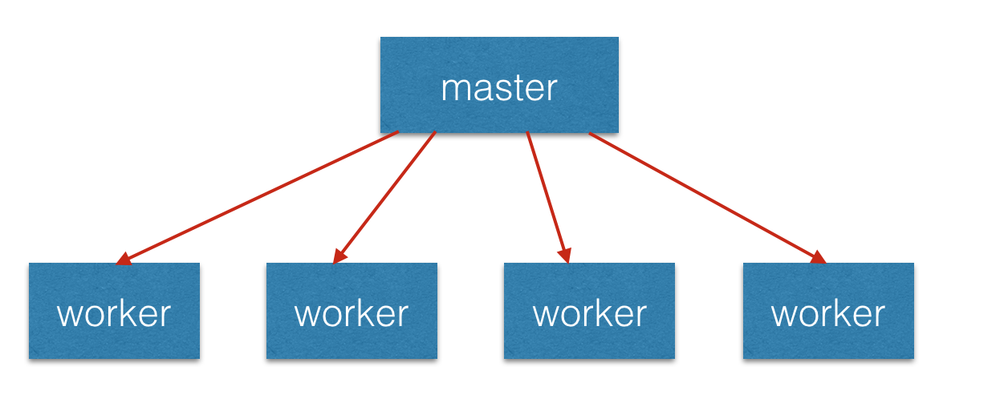

<br>

## 前言

`process`对象是一个全局亦是，它提供有关当前 Node.js 进程的信息并对其进行控制。

```
const process = require('process');
```

## 关于作者

一个工作八年的草根程序员。

## 内容

- 服务器进程进化
- 创建子进程
- 进程间通信
- 句柄传递

### 一、服务器进程进化

- 同步单进程服务器
- 同步多进程服务器
- 同步多进程多线程服务器
- 单进程单线程基于事件驱动的服务器
- NodeJS的实现多进程架构

#### 1.1 同步单进程服务器

该服务器是最早出现的，执行模型是同步的，它的服务模式是一次只能处理一个请求，其他的请求需要顺序依次等待处理执行。也就是说如果当前的请求正在处理的话，那么其他的请求都处于阻塞等待的状态。因此这样的服务器处理速度是不好的。

#### 1.2 同步多进程服务器

为了解决上面同步单进程服务器无法处理并发的问题，我们就出来一个同步多进程服务器，它的功能是一个请求需要一个进程来服务，也就是说如果有100个请求就需要100个进程来进行服务，那么这样就会有很大的进程的开销问题了。并且相同的状态在内在中会有多种，这样会造成资源浪费。

#### 1.3 同步多进程多线程服务器

为了解决上面多进程中资源浪费的问题，我们就引入了多进程多线程服务器模式，从我们之前一个进程处理一个请求，现在我们改成为一个线程来处理一个请求，纯种相对于进程来说开销会少很多，并且线程之间还可以共享数据。并且我们可以使用线程池减少创建和销毁的开销。

但是多线程也有缺点，比如多个请求需要使用多个线程来服务，但是每个纯种需要一定的内在来存放自己的堆和栈的。这样就会导致占用太多的内存。第二就是：CPU核心只能处理一件事件，系统是通过将CPU切分为时间片的方法来让线程可以均匀地使用CPU的资源的。在系统切换线程的过程中也会进行线程上下文切换，当线程数量过多时进行上下文切换会非常耗费时间的。因此在很大的并发量下，多线程还是无法做到很好的伸缩性。Apache服务器是这样架构的。

#### 1.4 单进程单线程基于事件驱动的服务器

为了解决上面的问题，我们出现了单进程单线程基于事件驱动的模式出现了，使用单线程的优点是：避免内存开销和上下文切换的开销。

所有的请求都在单线程上执行的，其他的异步IO和事件驱动相关的线程是通过libuv中的事件循环来实现内部的线程池和线程调度的。可伸缩性比之前的都好，但是影响事件驱动服务模型性能的只能CPU的计算能力，但是只能使用单核的CPU来处理事件驱动，但是我们的计算机目前都是多核的，我们要如何使用多核CPU呢？如果我们使用多核CPU的话，那么CPU的计算能力就会得到一个很大的提升。

#### 1.5 NodeJS的实现多进程架构

如上第四点，面对单线程单进程对多核使用率不好的问题，因此我们使用多进程，每个进程使用一个cpu，因此我们就可以实现多核cpu的利用。
Node提供了child_process模块和cluster模块来实现多进程以及进程的管理。也就是我们常说的 Master-Worker模式。也就是说进程分为Master(主)进程 和 worker（工作）进程。master进程负责调度或管理worker进程，那么worker进程负责具体的业务处理。在服务器层面来讲，worker可以是一个服务进程，负责出来自于客户端的请求，多个worker就相当于多个服务器，因此就构成了一个服务器群。master进程则负责创建worker，接收客户端的请求，然后分配到各个服务器上去处理，并且监控worker进程的运行状态及进行管理操作。

如下图所示：



### 二、创建子进程

创建子进程，有四个方法分别：

- **spawn**：子进程中执行的是非node程序，提供一组参数后，执行的结果以流的形式返回。
- **execFile**：子进程中执行的是非node程序，提供一组参数后，执行的结果以回调的形式返回。
- **exec**：子进程执行的是非node程序，提供一串shell命令，执行结果后以回调的形式返回，它与execFile不同的是，exec可以直接执行一串shell命令。
- **fork**：子进程执行的是node程序，提供一组参数后，执行的结果以流的形式返回，它与spawn不同的是，fork生成的子进程只能执行node应用。

```
var cp = require('child_process');
cp.spawn('node',['worker.js']);
cp.exec('node worker.js',function(err,stdout,stderr){
    // some code
});
cp.execFile('workder.js',function(err,stdout,stderr){

});
cp.fork('./worker.js');
```

| 类型       | 回调/异常 | 进程类型 | 执行类型       | 可设置超时 |
| ---------- | --------- | -------- | -------------- | ---------- |
| spawn()    | x         | 任意     | 命令           | x          |
| exec()     | ✓         | 任意     | 命令           | ✓          |
| execFile() | ✓         | 任意     | 可执行文件     | ✓          |
| fork()     | x         | node     | javascript文件 | x          |


### 三、进程间通信

在nodejs中父子进程之间通信可以通过on('message')和send()方法来实现通信，on('message')是监听message事件的。当该进程收到其他进程发送的消息时，便会触发message事件。send()方法则是用于向其他进程发送消息的。

```
// parent.js 
var cp = require('child_process');
var n = cp.fork(__dirname + '/sub.js');

n.on('message',function(m){

});
```

### 四、句柄传递

```
```

### 参考资料

- [Node.js 中文文档](http://nodejs.cn/api/process.html)
- [浅谈NodeJS多进程服务架构基本原理](https://www.cnblogs.com/tugenhua0707/p/11141076.html)
- 《深入浅出Node.js》

## 联系作者

<div align="center">
    <p>
        平凡世界，贵在坚持。
    </p>
    
</div>
